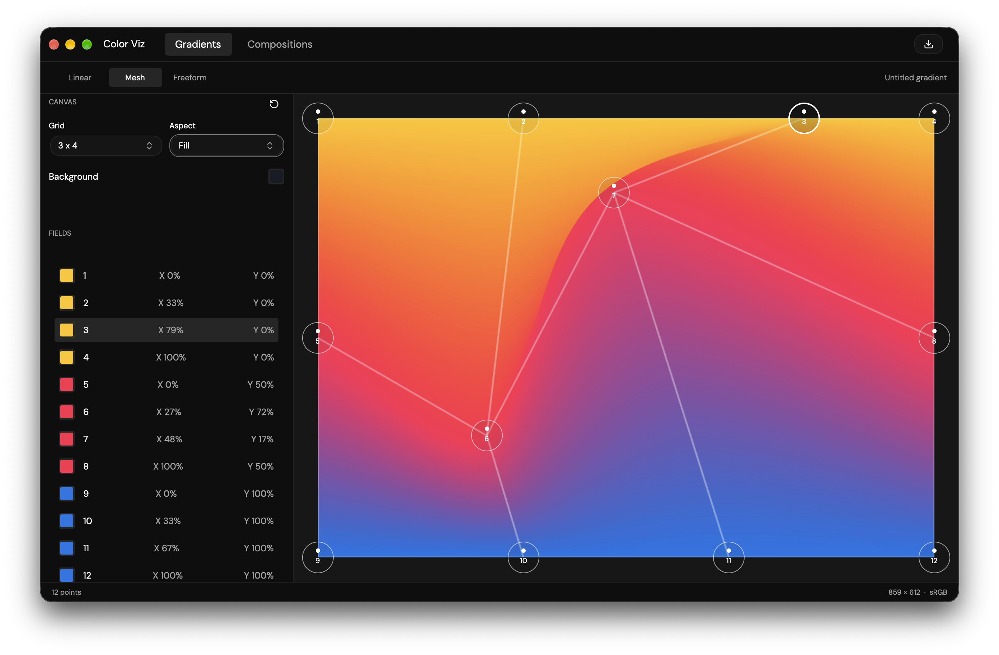

# gpui-luma

> **Early version.** This project is pre-release / alpha. APIs, crate layout, and examples may change without notice.

GPUI component library with a lookless control SDK, Shadcn and Radix look adapters,
color controls, and desktop example apps. Source lives at
[gpui-luma-dev/gpui-luma](https://github.com/gpui-luma-dev/gpui-luma);
[gpui-luma.dev](https://gpui-luma.dev) redirects to this repository.

Requires a recent Rust stable toolchain (`rust-toolchain.toml` tracks `stable`).

## Build

```bash
git clone https://github.com/gpui-luma-dev/gpui-luma.git
cd gpui-luma
cargo build --locked
```

The default build includes the SDK, Luma Studio, Neumorphic Demo, and Color Viz.
Use `cargo build --locked --workspace` to build all workspace packages.

## Library crates

| Crate | Purpose |
|---|---|
| [`gpui-luma`](crates/sdk/README.md) | Lookless controls, layouts, focus, interaction, motion, and shared theme contracts |
| [`gpui-luma-look-shadcn`](crates/look-shadcn/README.md) | Shadcn themes, CSS tokens, styled builders, and optional inspection tooling |
| [`gpui-luma-look-radix`](crates/look-radix/README.md) | Radix themes, palette scales, custom colors, and styled builders |
| [`gpui-luma-color`](crates/luma-color/README.md) | Color fields, rings, sliders, swatches, and color rendering primitives |

Depend on **`gpui-luma`**, then choose a look adapter. Add `gpui-luma-color` for
color controls. These four library crates are available on crates.io.

```sh
cargo add gpui-luma
cargo add gpui-luma-look-shadcn
# Or choose gpui-luma-look-radix instead.
cargo add gpui-unofficial --rename gpui
```

Import the SDK with `use gpui_luma::…`. Look adapter imports use
`gpui_luma_look_shadcn` or `gpui_luma_look_radix`.

## Shadcn themes

Shadcn themes load from strings with `ShadcnLook::from_css_str`. The bundled fallback
CSS is available as `gpui_luma_look_shadcn::FALLBACK_CSS`. The former `from_css_path` and
`from_css_path_with_stylesheet` helpers have been removed: applications own file
access and should enforce appropriate path and size restrictions before parsing.
For custom stylesheet TOML, use `StylesheetConfig::parse`, then
`ShadcnLook::from_css_str_with_stylesheet`. The string parsers do not impose size limits.

Use `ShadcnLook::built_in()` for the bundled fallback look. Enable the look crate's
`inspect` feature for developer inspection tools.

## Example programs

**Luma Studio** — Shadcn look workbench (control docs, theme inspection):


```bash
cargo run -p luma-studio
# or: just luma-studio
```

**Luma Radix Studio** — Radix style guide, custom palette editor, and control previews:


```bash
cargo run -p luma-radix-studio
# or: just luma-radix
```

Release builds: `cargo run -p luma-studio --release` / `cargo run -p luma-radix-studio --release` (or `just luma-studio-rel` / `just luma-radix-rel`).

**Color Viz (beta)** — An experimental gradient workbench designed to test the
performance of graphics operations in GPUI, including linear, mesh, and freeform
gradient rendering. **This application is beta** and serves as a graphics testing
workbench while its interface and rendering features evolve.



```bash
cargo run -p luma-color-viz -- default
```

Additional examples:

```bash
cargo run -p luma-neumorphic-demo
cargo run -p luma-shell-detached -- default
cargo run -p luma-shell-split-titlebar -- default
cargo run -p luma-shell-vscode -- default
cargo run -p luma-shell-2026 -- default
```

Color Viz and the shell demos accept `default` or a built-in Shadcn theme ID,
such as `retro-arcade`, as their first argument.

## Prebuilt executables

The [Build Luma Studio](https://github.com/gpui-luma-dev/gpui-luma/actions/workflows/build.yml)
workflow runs **manually only** using GitHub Actions' **Run workflow** button.
It builds `luma-studio` for macOS Apple Silicon, Windows x64, and Windows ARM64.
Download the executable ZIPs from a successful run's **Artifacts** section;
artifacts are retained for seven days.

## Development checks

[CI](https://github.com/gpui-luma-dev/gpui-luma/actions/workflows/ci.yml) runs on pull
requests and pushes to `main`, and can also be started manually. It checks
formatting, Clippy, and doctests on macOS. Pull requests run tests for the four
library crates; pushes to `main` and manual runs test the full workspace.
To run the full checks locally:

```bash
cargo fmt --all --check
cargo clippy --locked --workspace --all-targets --all-features
cargo test --locked --workspace --all-targets --all-features
cargo test --locked --workspace --doc --all-features
```

The `test-support` features enable headless GPUI interaction tests.

## License

Apache-2.0. See [LICENSE](LICENSE). Bundled third-party material retains its own
license terms; attribution files are included with the relevant crates and assets.
