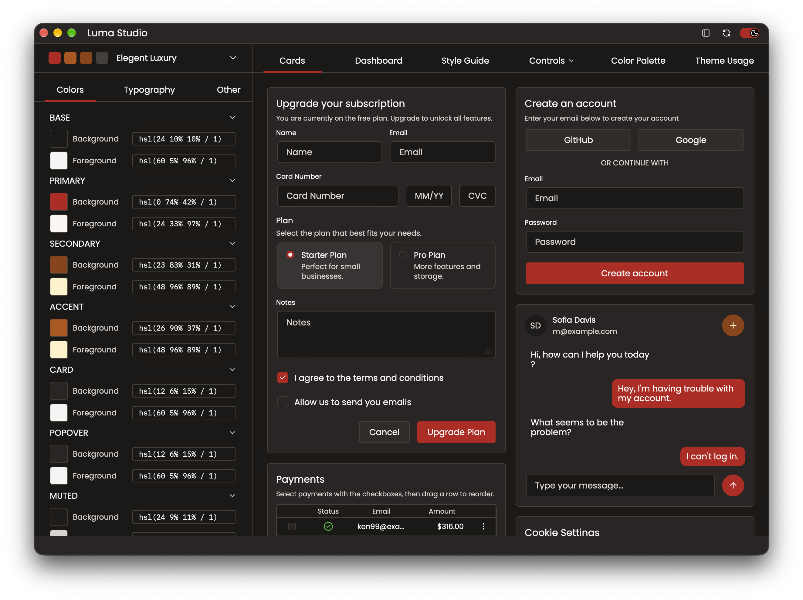
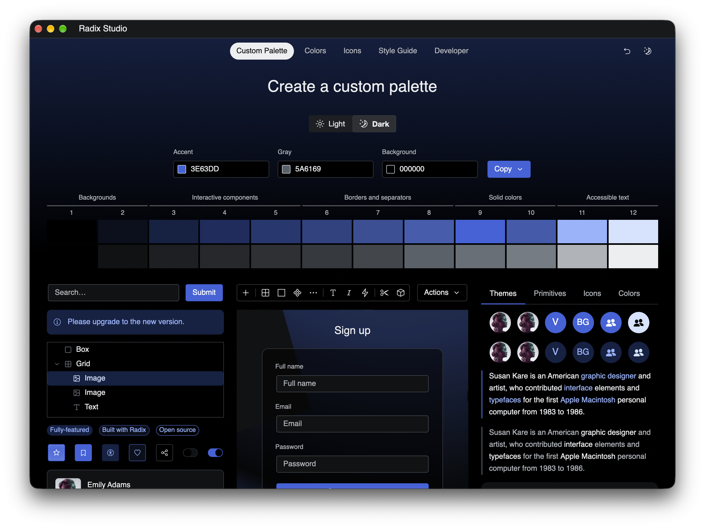

# gpui-luma

> **Early version.** This project is pre-release / alpha. APIs, crate layout, and examples may change without notice.

GPUI component library. Requires a recent Rust stable toolchain (`rust-toolchain.toml` pins `stable`).

## Build

```bash
git clone https://github.com/scottcg/gpui-luma.git
cd gpui-luma
cargo build
```

Library crates: depend on **`gpui-luma`** (controls, layouts, and shared look contracts), then **one** look — `gpui-luma-look-shadcn` *or* `gpui-luma-look-radix`. Optional: `gpui-luma-color`.

```sh
cargo add gpui-luma
cargo add gpui-luma-look-shadcn
# Or choose gpui-luma-look-radix instead.
```

Import the SDK with `use gpui_luma::…`.

Shadcn themes load from strings with `ShadcnLook::from_css_str`. The bundled fallback
CSS is available as `gpui_luma_look_shadcn::FALLBACK_CSS`. The former `from_css_path` and
`from_css_path_with_stylesheet` helpers have been removed: applications own file
access and should enforce appropriate path and size restrictions before parsing.
For custom stylesheet TOML, use `StylesheetConfig::parse`, then
`ShadcnLook::from_css_str_with_stylesheet`. The string parsers do not impose size limits.

## Example programs

**Luma Studio** — Shadcn look workbench (control docs, theme inspection):



```bash
cargo run -p luma-studio
# or: just luma-studio
```

**Luma Radix Studio** — Radix look stub workbench:



```bash
cargo run -p luma-radix-studio
# or: just luma-radix
```

Release builds: `cargo run -p luma-studio --release` / `cargo run -p luma-radix-studio --release` (or `just luma-studio-rel` / `just luma-radix-rel`).

## Prebuilt executables

The [Build Luma Studio](https://github.com/scottcg/gpui-luma/actions/workflows/build.yml) workflow publishes macOS and Windows `luma-studio` binaries as Actions artifacts (download from a successful run).
