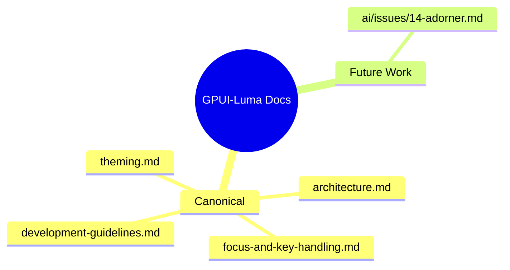

# GPUI-Luma Documentation Index

This folder contains architecture docs, control-specific notes, and future-work proposals.

If your viewer supports Mermaid, use the map below. If not, use the categorized list right after it.

## Categorized list

### Canonical (current source of truth)
- [`architecture.md`](./architecture.md) — workspace structure, crate maps, design splits, and boundary principles.
- [`development-guidelines.md`](./development-guidelines.md) — implementation rules, layout macros, re-entrancy snapshots, and standards.
- [`theming.md`](./theming.md) — style system design tiers, style.toml mappings, extensions, and typography guidelines.
- [`focus-and-key-handling.md`](./focus-and-key-handling.md) — focus traversal models, scopes, keyboard profiles, and default key bindings.

### Future work / proposals
- [`14-adorner.md`](./ai/issues/14-adorner.md) — focus adorner proposal.

