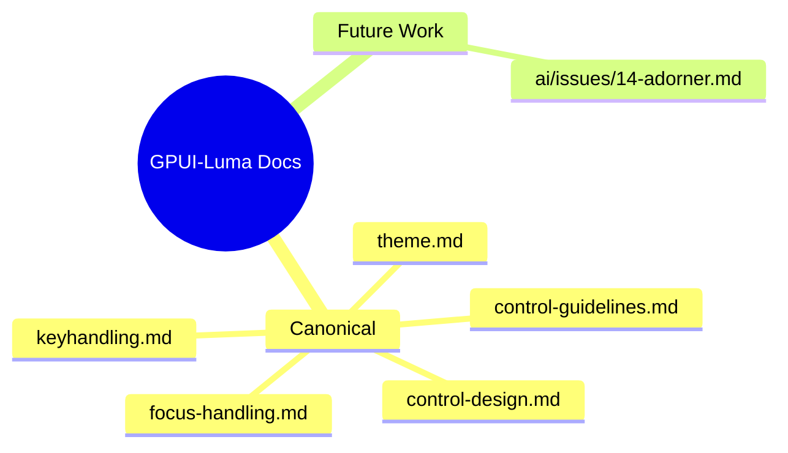

# GPUI-Luma Documentation Index

This folder contains architecture docs, control-specific notes, and future-work proposals.

If your viewer supports Mermaid, use the map below. If not, use the categorized list right after it.

## Categorized list

### Canonical (current source of truth)
- [`control-design.md`](./control-design.md) — control architecture and rationale.
- [`control-guidelines.md`](./control-guidelines.md) — implementation patterns and rules.
- [`focus-handling.md`](./focus-handling.md) — focus model and traversal behavior.
- [`keyhandling.md`](./keyhandling.md) — keyboard action and profile design.
- [`theme.md`](./theme.md) — theme strategy and token model.

### Future work / proposals
- [`14-adorner.md`](./ai/issues/14-adorner.md) — focus adorner proposal.

