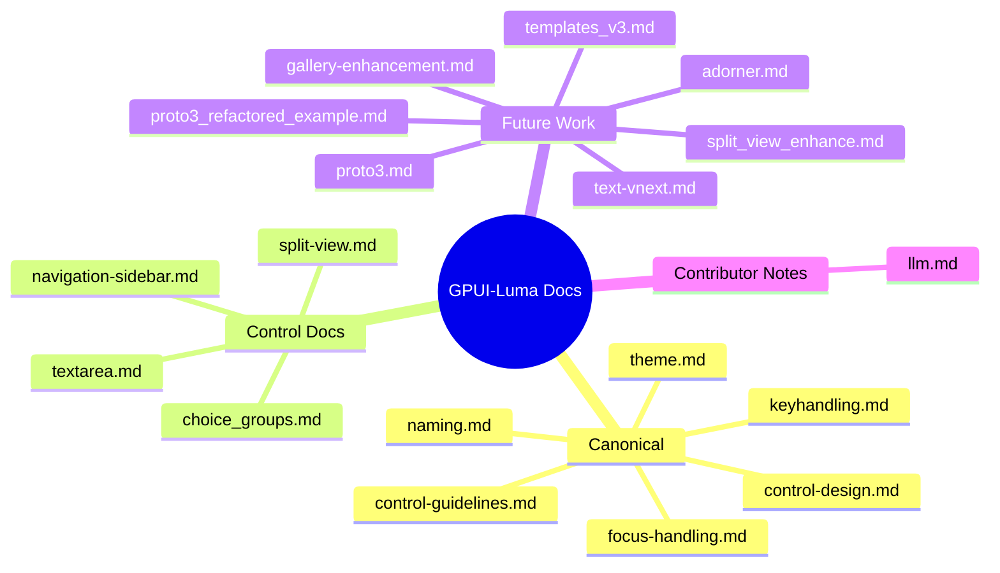

# GPUI-Luma Documentation Index

This folder contains architecture docs, control-specific notes, and future-work proposals.

If your viewer supports Mermaid, use the map below. If not, use the categorized list right after it.

## Categorized list

### Canonical (current source of truth)
- [`control-design.md`](./control-design.md) — control architecture and rationale.
- [`control-guidelines.md`](./control-guidelines.md) — implementation patterns and rules.
- [`focus-handling.md`](./focus-handling.md) — focus model and traversal behavior.
- [`keyhandling.md`](./keyhandling.md) — keyboard action and profile design.
- [`theme.md`](./theme.md) — theme strategy and token model.
- [`naming.md`](./naming.md) — SDK control naming conventions.

### Control docs
- [`choice_groups.md`](./choice_groups.md) — `ChoiceGroup` plan/status notes.
- [`navigation-sidebar.md`](./navigation-sidebar.md) — `NavigationSidebar` architecture.
- [`split-view.md`](./split-view.md) — `SplitView` baseline behavior and plan.
- [`textarea.md`](./textarea.md) — `TextArea` implementation overview.

### Future work / proposals
- [`adorner.md`](./adorner.md) — focus adorner proposal.
- [`gallery-enhancement.md`](./gallery-enhancement.md) — gallery theme observability.
- [`split_view_enhance.md`](./split_view_enhance.md) — extended split-view feature ideas.
- [`templates_v3.md`](./templates_v3.md) — template customization v3 direction.
- [`text-vnext.md`](./text-vnext.md) — next-gen text input architecture.
- [`proto3.md`](./proto3.md) — prototype-to-refactor decision doc.
- [`proto3_refactored_example.md`](./proto3_refactored_example.md) — typed metadata example.

### Contributor notes
- [`llm.md`](./llm.md) — contributor/assistant task context and guardrails.

