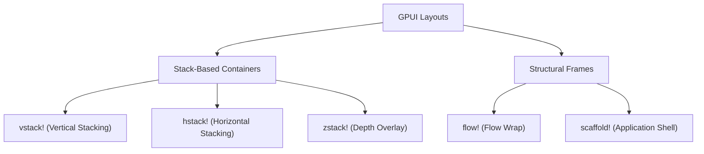

# Modern Declarative Layout Panels (V2 Design)

This document outlines a modern, stack-centric layout system for GPUI-Luma, taking inspiration from contemporary UI frameworks like **SwiftUI**, **Jetpack Compose**, and **Flutter**.

---

## 1. Core Concepts

Instead of using legacy XML-based names (`StackPanel`, `WrapPanel`, `DockPanel`), this V2 design focuses on lightweight stack containers (`vstack!`, `hstack!`, `zstack!`) and frame structures (`scaffold!`).



---

## 2. Macro Specifications & Implementations

To ensure these layouts can be distributed as a reusable part of the `gpui-luma` SDK, all macros are fully namespaced with absolute crate paths (e.g. `::gpui::div()`).

### 2.1 `vstack!` (Vertical Stack)

Arranges children sequentially down the Y-axis.

```rust
#[macro_export]
macro_rules! vstack {
    (
        $(gap=$gap:expr)? $(align=$align:ident)?;
        $( $child:expr ),* $(,)?
    ) => {{
        let mut panel = ::gpui::div().flex().flex_col();
        $( panel = panel.gap(::gpui::px($gap as f32)); )?
        $( panel = $crate::vstack!(@align_items panel, $align); )?
        $( panel = panel.child($child); )*
        panel
    }};

    (@align_items $panel:ident, center) => { $panel.items_center() };
    (@align_items $panel:ident, start) => { $panel.items_start() };
    (@align_items $panel:ident, end) => { $panel.items_end() };
}
```

---

### 2.2 `hstack!` (Horizontal Stack)

Arranges children sequentially along the X-axis.

```rust
#[macro_export]
macro_rules! hstack {
    (
        $(gap=$gap:expr)? $(align=$align:ident)?;
        $( $child:expr ),* $(,)?
    ) => {{
        let mut panel = ::gpui::div().flex();
        $( panel = panel.gap(::gpui::px($gap as f32)); )?
        $( panel = $crate::hstack!(@align_items panel, $align); )?
        $( panel = panel.child($child); )*
        panel
    }};

    (@align_items $panel:ident, center) => { $panel.items_center() };
    (@align_items $panel:ident, start) => { $panel.items_start() };
    (@align_items $panel:ident, end) => { $panel.items_end() };
}
```

---

### 2.3 `zstack!` (Depth Stack / Overlays)

Overlays children on top of each other along the Z-axis. The macro configures the relative container and absolute child layouts automatically.

```rust
#[macro_export]
macro_rules! zstack {
    (
        $( $child:expr ),* $(,)?
    ) => {{
        let mut panel = ::gpui::div().relative().size_full();
        $(
            panel = panel.child(
                ::gpui::div()
                    .absolute()
                    .size_full()
                    .child($child)
            );
        )*
        panel
    }};
}
```

---

### 2.4 `flow!` (Wrap Stack)

Flows children line-by-line horizontally, wrapping them automatically to the next line when constraints are hit.

```rust
#[macro_export]
macro_rules! flow {
    (
        $(gap=$gap:expr)? $(align=$align:ident)?;
        $( $child:expr ),* $(,)?
    ) => {{
        let mut panel = ::gpui::div().flex().flex_wrap();
        $( panel = panel.gap(::gpui::px($gap as f32)); )?
        $( panel = $crate::flow!(@align_items panel, $align); )?
        $( panel = panel.child($child); )*
        panel
    }};

    (@align_items $panel:ident, center) => { $panel.items_center() };
    (@align_items $panel:ident, start) => { $panel.items_start() };
    (@align_items $panel:ident, end) => { $panel.items_end() };
}
```

---

### 2.5 `scaffold!` (Layout Frame)

Pins layout structures to outer slots (top, left, right, bottom) and lets the central body expand to fill the rest of the available viewport.

```rust
#[macro_export]
macro_rules! scaffold {
    (
        $(top = $top:expr;)?
        $(left = $left:expr;)?
        $(right = $right:expr;)?
        $(bottom = $bottom:expr;)?
        body = $body:expr $(;)?
    ) => {{
        // Build the middle horizontal row: Left + Body + Right
        let mut middle = ::gpui::div().flex().flex_grow().overflow_hidden();
        $( middle = middle.child($left); )?
        middle = middle.child(::gpui::div().flex_grow().child($body));
        $( middle = middle.child($right); )?

        // Build the outer vertical container: Top + Middle + Bottom
        let mut outer = ::gpui::div().flex().flex_col().size_full();
        $( outer = outer.child($top); )?
        outer = outer.child(middle);
        $( outer = outer.child($bottom); )?
        
        outer
    }};
}
```

---

## 3. Example Usage in Gallery View

Here is how a panel layout would look when using the modern declarative V2 system:

```rust
fn render(&mut self, _window: &mut Window, _cx: &mut Context<Self>) -> impl IntoElement {
    scaffold! {
        top = header_bar(),
        left = navigation_sidebar(),
        body = vstack! {
            gap=16 align=start;
            card_title("Settings", "Manage your profile details"),
            
            hstack! {
                gap=8 align=center;
                self.first_name_input.clone(),
                self.last_name_input.clone(),
            },
            
            self.email_input.clone(),
            
            zstack! {
                avatar_image_view(),
                edit_badge_overlay(),
            },
        },
    }
}
```
