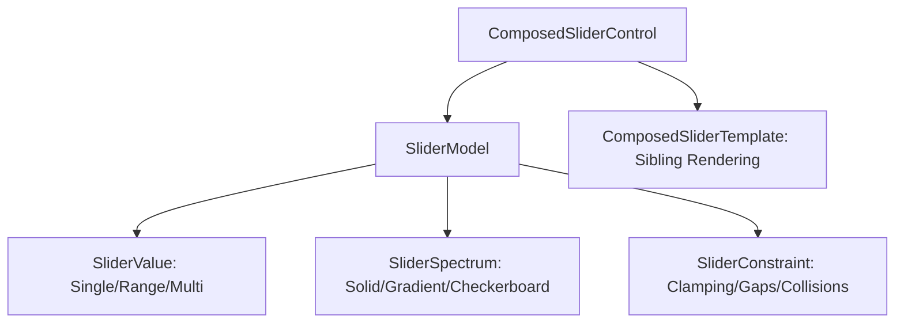

# Composed Slider Architecture

This document defines the unified, composable architecture for the **`ComposedSlider`**. It replaces the separate `Slider`, `RangeSlider`, and `ColorSlider` implementations, unifying their logic under a single control model with pluggable composition pieces.

---

## 1. Architectural Goals

1. **Composition over Duplication**: Single pointer tracking, drag-to-snap, and keyboard-stepping logic for all slider types.
2. **Pluggable Visual Fields**: Swap track colors (solid, gradient, spectrum, or checkerboard) without changing interaction logic.
3. **Occlusion-Based Gaps**: Represent gamut constraints and unfilled active areas alike as "occluded" (inactive) track segments.
4. **Zero Rounded Corner Clipping Bugs**: Completely bypass the GPUI rectangular-only `overflow_hidden()` clipping limitation using sibling-level corner rounding.

---

## 2. Core Composition Pieces

The `ComposedSlider` is built by composing three distinct, configurable structures.



### A. The Values Model: [`SliderValue`](file:///Users/scg/Developer/GitHub/gpui-luma/crates/sdk/src/controls/composed_slider/model.rs)
Supports single thumbs, range selections, or multi-thumb handles:

```rust
pub enum SliderValue {
    /// Single thumb slider (basic numeric slider, color slider, gamut slider)
    Single(f32),
    /// Two thumbs representing an editable range (min/max selection)
    Range(RangeInclusive<f32>),
    /// Multiple thumbs (e.g., color stop gradient editor)
    Multi(Vec<f32>),
}
```

### B. The Track Spectrum: [`SliderSpectrum`](file:///Users/scg/Developer/GitHub/gpui-luma/crates/sdk/src/controls/composed_slider/model.rs)
Defines what colors/patterns are painted along the active parts of the track:

```rust
pub struct SliderSpectrum {
    /// Stops along the track (0.0..=1.0). 
    /// - For solid color: a single stop or two stops of the same color.
    /// - For gradient: start and end colors.
    /// - For color spectrums: multi-stop color gradient stops.
    pub stops: Vec<(f32, Hsla)>,
    /// Whether to paint a background checkerboard pattern underneath (for opacity sliders)
    pub checkerboard: bool,
}
```

### C. The Track Segment Map: [`SliderTrackSegment`](file:///Users/scg/Developer/GitHub/gpui-luma/crates/sdk/src/controls/composed_slider/model.rs)
The track is partitioned into a contiguous list of non-overlapping segments covering $0.0 \dots 1.0$:

```rust
#[derive(Clone, Copy, Debug, PartialEq)]
pub enum SliderSegmentKind {
    /// Active region showing the underlying spectrum/color
    Active,
    /// Occluded region showing the inactive track background style
    Occluded,
}

#[derive(Clone, Copy, Debug, PartialEq)]
pub struct SliderTrackSegment {
    pub start_percentage: f32,
    pub end_percentage: f32,
    pub kind: SliderSegmentKind,
}
```

* **Standard Slider Mapping**: The region from `0.0` to `percentage` is `Active` (solid color gradient); the region from `percentage` to `1.0` is `Occluded` (track background color).
* **Gamut-Constrained Slider Mapping**: Valid gamut intervals are mapped as `Active` (color spectrum gradient); invalid ranges are mapped as `Occluded` (inactive grey/track color).
* **Editable Range Slider Mapping**: The region between `min` and `max` is `Active`; the regions `0.0..min` and `max..1.0` are `Occluded`.

---

## 3. Interaction & Snap Engine: [`ComposedSliderControl`](file:///Users/scg/Developer/GitHub/gpui-luma/crates/sdk/src/controls/composed_slider/control.rs)

The core control Entity owns the interaction state and maps pointer/keyboard inputs:

1. **Closest Thumb Active Dragging**:
   - On mouse down, calculate the clicked percentage and activate the closest thumb in `SliderValue`.
   - Prevent multi-thumb cross-over collision boundaries.
2. **Snap and Jump Constraints**:
   - Clicking or dragging snaps the active thumb instantly to the nearest boundary of the closest `Active` segment (skipping over `Occluded` gaps).
3. **Keyboard Stepping**:
   - Arrow keys step the active thumb, dynamically adjusting the delta to bridge across `Occluded` gap segments.

---

## 4. Sibling Rendering Template: [`ComposedSliderTemplate`](file:///Users/scg/Developer/GitHub/gpui-luma/crates/sdk/src/controls/composed_slider/template.rs)

To solve the rounded corner issue without relying on rectangular `overflow_hidden()` clipping, the single template renders all segments as non-overlapping siblings:

```rust
// In ComposedSliderTemplate::render:
model.track_segments.iter().enumerate().map(|(i, segment)| {
    let start = segment.start_percentage.clamp(0.0, 1.0);
    let width = (segment.end_percentage - segment.start_percentage).clamp(0.0, 1.0);
    let is_first = i == 0;
    let is_last = i == model.track_segments.len() - 1;

    let mut element = div()
        .absolute()
        .left(relative(start))
        .w(relative(width))
        .h_full();

    // Paint background (either the Active Spectrum or Occluded style)
    element = paint_segment_background(element, segment, &model.spectrum);

    // Apply corner rounding ONLY to outermost boundaries
    if is_first && is_last {
        element = element.rounded(track_radius);
    } else if is_first {
        element = element.rounded_tl(track_radius).rounded_bl(track_radius);
    } else if is_last {
        element = element.rounded_tr(track_radius).rounded_br(track_radius);
    }
    
    element
})
```

---

## 5. Theme Integration

All variants share a unified `SliderTheme` stylesheet mapping:
* **Metrics**: Resolves `track_height`, `thumb_size`, and `radius` from the cached `ControlSize` configuration.
* **Colors**: Matches standard tokens (`track_background`, `fill_background`, `thumb_background`, `thumb_border`, `focus_ring`).

---

## 6. Implementation Strategy

We will carry out this refactor as a new work package to prevent breaking any current code paths:

1. **Step 1: Scaffold new control**: Create [`crates/sdk/src/controls/composed_slider/`](file:///Users/scg/Developer/GitHub/gpui-luma/crates/sdk/src/controls/composed_slider/) and implement the unified `model`, `control`, and `template`.
2. **Step 2: Add Showcase Pane**: Create a dedicated validation pane in the gallery app showcasing standard, range, and color configurations all powered by `ComposedSlider`.
3. **Step 3: Deprecate & Delete**: Once fully functional and aligned with tests, migrate existing calls to `ComposedSlider` and delete the old `Slider` and `RangeSlider` crates/folders.
