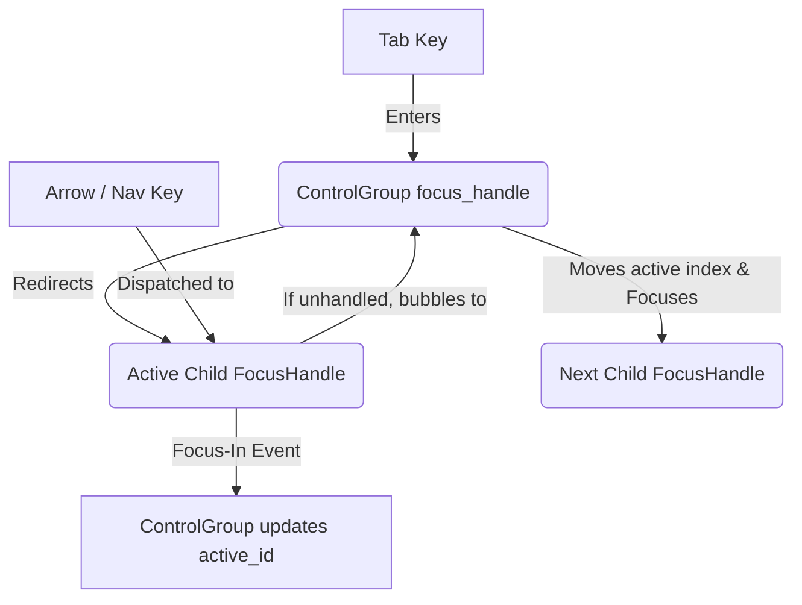

# Control Group Focus Preparation

## Context & Objectives

To support complex composite controls like a **Toolbar**, the underlying `control_group` focus strategy (`ControlGroupFocusStrategy::RovingItemFocus`) must be upgraded. 

This document outlines the focus cooperation model between `control_group` and hosted child controls in GPUI, specifying the exact changes required before implementing the Toolbar.

---

## The GPUI Focus Cooperation Model

GPUI's focus tree is hierarchical and action-based. We will leverage native GPUI primitives (Focus Tree nesting and Action Bubbling) to coordinate focus:



---

## 1. Upgrading `control_group`

We need to add state synchronization and action bubbling support to `ControlGroupControl`.

### A. Focus Synchronization (Child-to-Parent)
When a child receives focus (via mouse clicks, internal triggers, etc.), the group must sync its `active_id` to that child.
* **Observer Registration:**
  In `ControlGroupControl::render` (or during state setup), resolve the child `FocusHandle`s and subscribe to focus-in events:
  ```rust
  // For each item that provides a FocusHandle
  self.focus_subscriptions.push(
      cx.on_focus_in(&target.focus_handle, move |this, window, cx| {
          this.set_active_id_from_focus(item_id, cx);
      })
  );
  ```

### B. Action Bubbling & Key Interception
* **Action Handlers:** The group already registers listeners for navigation actions (`SelectNextItem`, `SelectPreviousItem`, `SelectFirstItem`, `SelectLastItem`).
* **Bubbling:** If focus is on a child's focus handle, these actions will bubble up to the group's focus handle. The group moves focus using `self.move_active(...)`.

---

## 2. Updates to SDK Controls (TextField, Selector, PopupMenu)

To coordinate with the roving focus strategy, hosted controls must support:

### A. Exclude from Tab Ring
* Add a `tab_stop(bool)` modifier to `TextFieldBuilder`, `SelectorBuilder`, and `PopupMenuBuilder` (defaulting to `true`).
* When hosted in a toolbar, these controls will be initialized with `.tab_stop(false)`.

### B. Handle Arrow Key Trapping
* Replace the binary `ChildOwnsWhenFocused` arrow policy with directional and conditional policies.
* Allow child controls to selectively consume keys (e.g. `TextField` consumes Left/Right but bubbles Up/Down; `PopupMenu` bubbles arrows when closed but consumes them when open).

### C. Clean up Overlays on Focus Loss
* Ensure `PopupMenu` and `Selector` triggers close their active overlays when their focus handle receives a focus-out event (`cx.on_focus_out`).

---

## Implementation Sequence

1. **Phase 1: ControlGroup Enhancements**
   * Implement focus-in subscription mapping in `ControlGroupControl`.
   * Add `tab_stop` configuration to `control_group`'s builder.
   
2. **Phase 2: SDK Control Integration**
   * Update `TextField`, `Selector`, and `PopupMenu` to support dynamic `tab_stop` configuration and focus-out listeners.

3. **Phase 3: Toolbar Implementation**
   * Implement `Toolbar` on top of `control_group` configured with horizontal layout and roving focus strategy.
