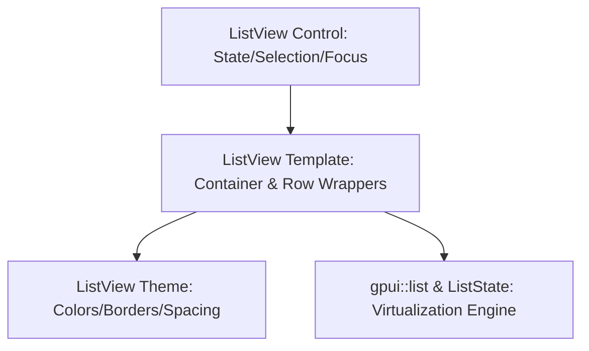

# Virtualizing ListView Control Design

This document details the architectural design for a virtualizing `ListView` control in GPUI-Luma, inspired by WPF's `ListView` and aligned with the lookless control design guidelines.

---

## 1. Core Architecture

Like all GPUI-Luma controls, `ListView` separates state/behavior, presentation structure, and styling into distinct layers.



1. **Behavior (`model.rs` & `control.rs`)**: Manages the backing items, selection state (single/multiple/none), scrolling, keyboard navigation (roving focus), and coordinates the `gpui::ListState` virtualization handle.
2. **Presentation (`template.rs`)**: Controls the layout container structure, grid headers (if columns are used), and maps raw items to interactive row elements.
3. **Appearance (`theme.rs`)**: Governs list background, border tokens, active item focus-ring appearance, and row hover/selected states.

## 2. Virtualization Constraints & Delegate Engine

### 2.1 Why Virtualization is Mandatory in GPUI
Unlike traditional document-style layout systems that can handle large numbers of hidden elements, GPUI is a **GPU-accelerated immediate-mode layout engine**. 
* **The Element Explosion**: If you attempt to render a list of 10,000 items as standard child nodes (`div().child(item1).child(item2)...`), GPUI must perform layout math, text styling, and draw call batching for **every single item** on every frame. This immediately collapses frame rates and exhausts GPU memory.
* **Viewport Intersecting**: GPUI lists must be virtualized from day one. Using GPUI's virtualized list primitives (e.g., `gpui::list` or custom virtual scroll helpers), GPUI only instantiates, layouts, and paints the 10-30 elements currently visible inside the viewport.

### 2.2 The ListDelegate & Rows Cache Model
Following the architecture seen in the `gpui-component` list crate, `ListView` uses a **Delegate & Cache** pattern to power its virtualization:

1. **`ListDelegate`**: Instead of copying datasets into the control directly, a delegate trait handles data lookup and item rendering on-demand. This allows virtual lists to easily handle asynchronous search, sectional grouping (headers/footers), and infinite scrolling (`load_more`).
2. **`RowsCache`**: To track viewport boundaries and allow precise scrollbar tracking without laying out offscreen elements, row heights are measured once and cached, enabling instant scroll offset estimation.

### 2.3 Virtualized Row Delegation
The control initializes GPUI's virtualization engine, delegating row rendering on-demand:

```rust
// Inside the control initialization
let list_state = ListState::new(
    items.len(),
    ListAlignment::Top,
    px(40.0), // Measured row height estimate
    move |index, window, cx| {
        // Rendered strictly for visible rows!
        this.update(cx, |this, cx| {
            this.render_row(index, window, cx)
        })
    }
);
```


---

## 3. Public API & Interfaces

### 3.1 The Behavior Layer (`ListView` & `ListViewBuilder`)

The control manages selection mode, item iteration, and wraps GPUI's focus tracking:

```rust
pub enum ListSelectionMode {
    None,
    Single,
    Multiple,
}

pub struct ListView<T: 'static> {
    id: SharedString,
    items: Vec<T>,
    selected_indices: HashSet<usize>,
    selection_mode: ListSelectionMode,
    list_state: ListState,
    focus_handle: FocusHandle,
}

impl<T> ListView<T> {
    pub fn set_items(&mut self, items: Vec<T>, cx: &mut Context<Self>) {
        self.items = items;
        // Refresh the virtualized list state
        self.list_state.reset(self.items.len());
        cx.notify();
    }

    pub fn selected_items(&self) -> Vec<&T> {
        self.selected_indices.iter().map(|&i| &self.items[i]).collect()
    }
}
```

---

### 3.2 The Template Layer (`ListViewTemplate`)

The template defines how the outer container and column headers (if applicable) are laid out:

```rust
pub struct ListViewRenderModel<'a, T> {
    pub id: &'a SharedString,
    pub list_state: &'a ListState,
    pub focus_handle: &'a FocusHandle,
    pub is_focused: bool,
}

/// Defines how the outer collection container (borders, scrollbars, headers) is structured
pub trait ListViewTemplate<T>: Send + Sync {
    fn render(
        &self,
        model: &ListViewRenderModel<'_, T>,
        window: &mut Window,
        cx: &mut App,
    ) -> Stateful<Div>;
}

pub struct ListViewItemRenderModel<'a, T> {
    pub item: &'a T,
    pub index: usize,
    pub selected: bool,
    pub active: bool,
    pub hovered: bool,
}

/// Defines how an individual item/row in the virtualized list is formatted
pub type ListViewItemTemplate<T> = Arc<
    dyn for<'a> Fn(
            &ListViewItemRenderModel<'a, T>,
            &mut Window,
            &mut App,
        ) -> AnyElement
        + Send
        + Sync
        + 'static,
>;

```

---

### 3.3 The Appearance Layer (`ListViewTheme`)

The theme resolves states into visual attributes:

```rust
pub struct ListViewAppearance {
    pub background: Hsla,
    pub border: Hsla,
    pub radius: f32,
    pub padding: f32,
}

pub struct ListViewRowAppearance {
    pub background: Hsla,
    pub foreground: Hsla,
    pub focus_ring: Option<Hsla>,
}

pub trait ListViewTheme: Send + Sync {
    fn resolve_list(&self, enabled: bool, focused: bool) -> ListViewAppearance;
    
    fn resolve_row(
        &self,
        selected: bool,
        hovered: bool,
        focused: bool,
    ) -> ListViewRowAppearance;
}
```

---

## 4. Usage Example (Gallery Implementation)

Here is how a developer would construct and render a virtualized `ListView`:

```rust
struct UserData {
    id: String,
    name: String,
    email: String,
}

// In the panel constructor
let list_view = ListView::new("user-list")
    .selection_mode(ListSelectionMode::Single)
    .items(load_10000_users())
    // Bind item rendering callback
    .item_template(make_list_view_item_template(|model, _window, _cx| {
        div()
            .flex()
            .justify_between()
            .child(model.item.name.clone())
            .child(model.item.email.clone())
            .into_any_element()
    }))
    .spawn(cx);


// In the subscriptions block
cx.subscribe(&list_view, |this, _, event: &ListViewEvent, cx| {
    match event {
        ListViewEvent::SelectionChanged { selected_indices } => {
            println!("Selected row indices: {:?}", selected_indices);
        }
    }
});
```

---

## 5. Keyboard Navigation & Accessibility

To align with standard accessibility guidelines, the `ListView` control manages **Roving Focus** using standard list keyboard shortcuts:

* `ArrowUp` / `ArrowDown`: Move the active/focused item marker.
* `Space` / `Enter`: Toggle selection on the active item.
* `Shift + ArrowUp/ArrowDown`: Expand selection (if in `ListSelectionMode::Multiple`).
* `Home` / `End`: Scroll to and focus the first/last item.

---

## 6. WPF XAML-Inspired Declarative Syntax

To capture the clear, self-documenting feel of WPF XAML layout structure, the `ListView` can be initialized using a declarative macro. This brings `ItemTemplate` and `GridView` layouts into clean, code-first Rust structure.

### 6.1 Simple ItemTemplate View

For standard linear lists, the macro specifies a clear `item_template` representing the row element layout:

```rust
let list_view = list_view! {
    id = "user-list";
    items = load_10000_users();
    selection = ListSelectionMode::Single;
    
    // Equivalent to WPF's <ListView.ItemTemplate>
    item_template = |user| stack_panel! {
        horizontal gap=12 items=center;
        lucide_glyph(LucideIcon::User),
        stack_panel! {
            vertical;
            text(user.name.clone()).font_weight(FontWeight::BOLD),
            text(user.email.clone()).text_color(chrome.muted_text),
        }
    };
}.spawn(cx);
```

### 6.2 GridView Column Bindings

For multi-column tables, the macro mimics WPF's `<ListView.View><GridView>` layout. It defines column headers, column widths, and cell templates in a structured columns block:

```rust
let grid_view = list_view! {
    id = "user-grid";
    items = load_10000_users();
    selection = ListSelectionMode::Multiple;
    
    // Equivalent to WPF's <ListView.View><GridView>
    grid_view = {
        column!("Name", width=150 => |user| user.name.clone()),
        column!("Email", width=250 => |user| user.email.clone()),
        column!("Role", width=120 => |user| user.role.clone()),
        column!("Status", width=100 => |user| status_badge(&user.status)),
    };
}.spawn(cx);
```

### 6.3 The Macro Mechanics

This macro parses the syntax blocks and generates the boilerplate under the hood:
1. Instantiates a `ListViewBuilder`.
2. Registers columns, header views, and cell mapping logic.
3. Automatically sets up the row rendering template to distribute columns horizontally within the row viewport.

