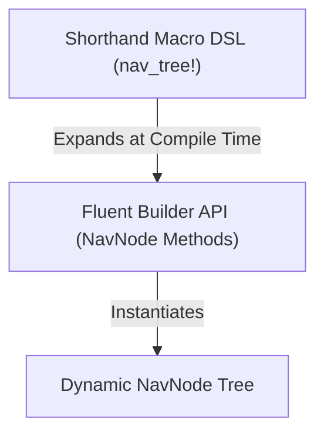

# Navigation Tree Declarative Structure Design

This document outlines the proposed design to improve the declarative nature of navigation tree definitions (such as sidebar links and property lists) in `gpui-luma`, specifically targeting the refactoring of [navigation_sidebar.rs](file:///Users/scg/Developer/GitHub/gpui-luma/apps/theme-studio/src/studio/panels/navigation_sidebar.rs).

## Problem Statement

Currently, the navigation hierarchy in [navigation_sidebar.rs](file:///Users/scg/Developer/GitHub/gpui-luma/apps/theme-studio/src/studio/panels/navigation_sidebar.rs) is defined using multiple static, flat arrays (`PINNED_PROPERTIES`, `LAYOUT_PROPERTIES`, etc.) which are then references inside group arrays, and stitched together at runtime in the `property_nodes()` function.

### Limitations:
1. **Fragmentation**: The hierarchical structure is split across multiple separate array variables, making it hard to visualize or refactor.
2. **Boilerplate**: Constant repetition of `PropertyLeaf { id, label, icon, enabled }` struct declarations.
3. **Rigidity**: Modifying tree nesting or leaf-group ownership requires changing declarations in multiple disconnected locations.

---

## Proposed Solution: Combined Fluent & Macro Declarative Hierarchy

The proposed design combines a **Fluent Builder API (Option 1)** with a **Syntactic Macro DSL (Option 2)**. Because the macro DSL expands to builder methods at compile time, the two approaches work together seamlessly.



### 1. Fluent Builder API (Option 1)
Using the existing builder methods on [NavNode](file:///Users/scg/Developer/GitHub/gpui-luma/crates/sdk/src/controls/navigation_sidebar/model.rs), we can write the tree in a single nested expression.

```rust
fn property_nodes() -> Vec<NavNode> {
    vec![
        // Pinned Section
        NavNode::section("pinned-label", "Pinned"),
        NavNode::new("summary").label("Summary").icon(LucideIcon::Info),
        NavNode::new("tokens").label("Design Tokens").icon(LucideIcon::Tags),

        // Properties Section
        NavNode::section("properties-label", "Properties"),
        
        // Layout Group
        NavNode::new("layout")
            .label("Layout")
            .icon(LucideIcon::Ruler)
            .expanded(true)
            .children([
                NavNode::new("position").label("Position"),
                NavNode::new("dimensions").label("Dimensions"),
            ]),
    ]
}
```

### 2. Macro DSL Syntax (Option 2)
To remove boilerplate, we define a declarative helper macro `nav_tree!` that supports shorthand tuple expressions for simple sections, parent groups, and leaf nodes.

```rust
macro_rules! nav_tree {
    ( $( $node:tt ),* $(,)? ) => {
        vec![ $( nav_node!( $node ) ),* ]
    };
}

macro_rules! nav_node {
    // Shorthand: Section Header
    ( section $id:expr => $label:expr ) => {
        NavNode::section($id, $label)
    };
    
    // Shorthand: Group with children
    ( ( $id:expr, $label:expr, $icon:expr, expanded: $expanded:expr, [ $( $child:tt ),* $(,)? ] ) ) => {
        NavNode::new($id)
            .label($label)
            .icon($icon)
            .expanded($expanded)
            .children(vec![ $( nav_node!( $child ) ),* ])
    };

    // Shorthand: Leaf item with icon (and optional enabled state)
    ( ( $id:expr, $label:expr, $icon:expr $(, enabled: $enabled:expr )? ) ) => {
        {
            let mut node = NavNode::new($id).label($label).icon($icon);
            $( node = node.enabled($enabled); )?
            node
        }
    };

    // Shorthand: Leaf item without icon (and optional enabled state)
    ( ( $id:expr, $label:expr $(, enabled: $enabled:expr )? ) ) => {
        {
            let mut node = NavNode::new($id).label($label);
            $( node = node.enabled($enabled); )?
            node
        }
    };

    // Fallback: Any arbitrary Rust expression (allows mixing fluent builders inline)
    ( $expr:expr ) => {
        $expr
    };
}
```

---

## Reference Implementation Example

With the macro defined, developers can define the entire tree structure in one declarative place, mixing shorthand notation for boilerplate items and standard fluent method calls for dynamic nodes:

```rust
fn property_nodes(show_reset: bool) -> Vec<NavNode> {
    nav_tree![
        // Shorthand for simple section header
        section "pinned-label" => "Pinned",
        
        // Shorthand for simple items
        ("summary", "Summary", LucideIcon::Info),

        // Hybrid: arbitrary fluent builder call mixed inline
        NavNode::new("tokens")
            .label("Design Tokens")
            .icon(LucideIcon::Tags)
            .enabled(true)
            .visible(show_reset),

        section "properties-label" => "Properties",
        
        // Shorthand for nested layout group
        ("layout", "Layout", LucideIcon::Ruler, expanded: true, [
            ("position", "Position"),
            ("dimensions", "Dimensions"),
            
            // Nested fluent builder inside shorthand group
            NavNode::new("constraints")
                .label("Constraints")
                .presenter(custom_presenter_logic())
        ]),
    ]
}
```

## Benefits
* **High Readability**: Tree nesting directly matches structural representation.
* **Low Noise**: 90% of nodes use simple tuple structures.
* **No Constraints**: Full compiler-checked Rust code and builders can be nested dynamically inside the macro.
