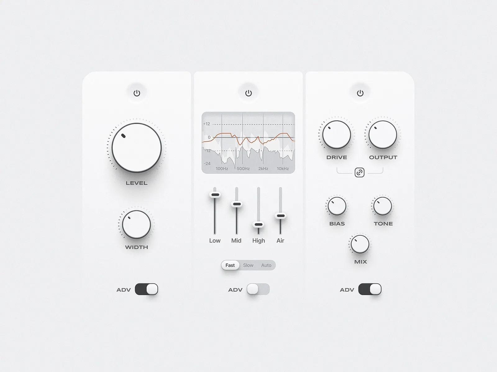

# Soft-Neumorphic Audio Interface Implementation Plan

This document outlines a complete implementation plan for a standalone neumorphic audio dashboard demo application using GPUI and the `gpui-luma` SDK.

The design relies on "soft-skeuomorphism"—creating visual depth with highlights and shadows to make elements appear raised (embossed) or recessed (debossed) relative to the background plane.



---

## 1. Directory Structure

The demo will be a standalone consumer application inside the workspace under `apps/neumorphic-demo`, depending on `crates/sdk` and borrowing the parsing logic from `crates/look-shadcn`.

```text
apps/neumorphic-demo/
├── Cargo.toml
├── assets/
│   ├── theme.css             # Light/Dark neumorphic CSS tokens
│   └── style.toml            # Component state-selector mappings
└── src/
    ├── main.rs               # Application bootstrap
    ├── look/
    │   ├── mod.rs            # Mini-look loader and engine
    │   ├── resolver.rs       # CSS/TOML resolvers
    │   ├── button.rs         # Embossed button template
    │   ├── switch.rs         # Recessed track + raised thumb switch template
    │   └── slider.rs         # Recessed groove + raised handle fader template
    └── components/
        ├── mod.rs
        ├── knob.rs           # Custom vector-drawn rotary dial (GPUI canvas)
        └── panel.rs          # Tactile deck layout
```

---

## 2. Style System Setup (`assets/`)

### A. Design Tokens (`assets/theme.css`)
Neumorphism is highly sensitive to color values. The light source is typically assumed to come from the **top-left**.
*   **Raised (Embossed):** A dark shadow on the bottom-right, paired with a light highlight on the top-left.
*   **Recessed (Debossed):** An inset dark shadow on the top-left, paired with an inset light highlight on the bottom-right.

```css
:root {
  /* Core background matches the element fill for neumorphic blending */
  --bg-deck: hsl(210 20% 95%);
  --bg-element: hsl(210 20% 95%);
  
  /* Text and Indicators */
  --text-active: hsl(210 20% 15%);
  --text-muted: hsl(210 10% 55%);
  --indicator-active: hsl(15 90% 50%); /* Accent color for active state */

  /* Drop Shadows (Embossed) */
  --shadow-raised: 
    3px 3px 6px hsl(210 20% 85%), 
    -3px -3px 6px hsl(0 0% 100%);
  
  --shadow-raised-hover: 
    4px 6px 12px hsl(210 20% 80%), 
    -4px -6px 12px hsl(0 0% 100%);

  /* Inset Shadows (Debossed) */
  --shadow-recessed: 
    inset 2px 2px 5px hsl(210 20% 85%), 
    inset -2px -2px 5px hsl(0 0% 100%);
}

.dark {
  --bg-deck: hsl(210 10% 12%);
  --bg-element: hsl(210 10% 12%);
  
  --text-active: hsl(210 10% 90%);
  --text-muted: hsl(210 10% 50%);
  --indicator-active: hsl(15 90% 55%);

  --shadow-raised: 
    3px 3px 6px hsl(210 10% 8%), 
    -3px -3px 6px hsl(210 10% 16%);
    
  --shadow-raised-hover: 
    4px 6px 12px hsl(210 10% 6%), 
    -4px -6px 12px hsl(210 10% 18%);

  --shadow-recessed: 
    inset 2px 2px 5px hsl(210 10% 7%), 
    inset -2px -2px 5px hsl(210 10% 17%);
}
```

### B. Selector Mappings (`assets/style.toml`)
We map standard control states to the neumorphic shadows and colors.

```toml
# =====================================================================
# Toggle Switch Mappings
# =====================================================================
[switch.track.default]
background = "bg-deck"
shadow = "shadow-recessed"
corner_radius = "9999.0"

[switch.thumb.inactive]
background = "bg-element"
shadow = "shadow-raised"
corner_radius = "9999.0"

[switch.thumb.active]
background = "text-active"
shadow = "shadow-raised"
corner_radius = "9999.0"

# =====================================================================
# Vertical Slider Fader Mappings
# =====================================================================
[slider.track]
background = "bg-deck"
shadow = "shadow-recessed"
width = "6.0"

[slider.handle.default]
background = "bg-element"
shadow = "shadow-raised"
corner_radius = "4.0"

[slider.handle.hover]
background = "bg-element"
shadow = "shadow-raised-hover"
corner_radius = "4.0"
```

---

## 3. Custom Knobs Component (Direct GPUI Canvas Drawing)

Since knobs are circular and rotate, standard CSS/Taffy layouts are insufficient. We will build a custom GPUI `Knob` element utilizing direct vector painting inside `PaintContext`.

### A. Knob Behavior State
```rust
// apps/neumorphic-demo/src/components/knob.rs
use gpui::*;
use std::f32::consts::PI;

pub struct Knob {
    id: ElementId,
    label: SharedString,
    value: f32, // Normalized 0.0..1.0
    on_change: Box<dyn Fn(f32, &mut WindowContext) + 'static>,
}

impl Knob {
    pub fn new(
        id: impl Into<ElementId>,
        label: impl Into<SharedString>,
        initial_value: f32,
        on_change: impl Fn(f32, &mut WindowContext) + 'static,
    ) -> Self {
        Self {
            id: id.into(),
            label: label.into(),
            value: initial_value.clamp(0.0, 1.0),
            on_change: Box::new(on_change),
        }
    }
}
```

### B. Custom Painting Logic
The dial's outer bezel gets a drop shadow, a subtle border, and paints an indicator dot rotating along an arc from $-225^\circ$ to $45^\circ$.

```rust
impl IntoElement for Knob {
    type Element = Self;

    fn into_element(self, _cx: &mut WindowContext) -> Self::Element {
        self
    }
}

impl Element for Knob {
    type RequestLayoutState = ();
    type PaintState = ();

    fn id(&self) -> Option<ElementId> {
        Some(self.id.clone())
    }

    fn request_layout(
        &mut self,
        _id: Option<&ElementId>,
        cx: &mut WindowContext,
    ) -> (LayoutId, Self::RequestLayoutState) {
        // Define size constraints (e.g., fixed square bounds for the circular knob)
        let mut style = Style::default();
        style.size = Size {
            width: Length::Definite(px(80.0)),
            height: Length::Definite(px(80.0)),
        };
        (cx.request_layout(style, None), ())
    }

    fn paint(
        &mut self,
        _id: Option<&ElementId>,
        bounds: Bounds<f32>,
        _layout: &mut Self::RequestLayoutState,
        _paint: &mut Self::PaintState,
        cx: &mut WindowContext,
    ) {
        let center = bounds.center();
        let radius = bounds.size.width / 2.0 - 8.0;

        // 1. Draw raised tactile dial circle (using GPUI physical shadows)
        let background_color = cx.theme().color("bg-element");
        let light_shadow_color = cx.theme().color("shadow-light");
        let dark_shadow_color = cx.theme().color("shadow-dark");

        // Embossed bevel simulation: Bottom-Right Dark, Top-Left Light
        cx.paint_circle_shadow(center, radius, dark_shadow_color, point(3.0, 3.0), 6.0);
        cx.paint_circle_shadow(center, radius, light_shadow_color, point(-3.0, -3.0), 6.0);
        cx.paint_circle(center, radius, background_color);

        // 2. Draw circular border highlight
        cx.paint_circle_stroke(center, radius, cx.theme().color("border"), 1.0);

        // 3. Draw indicator dot
        // Map 0.0..1.0 to an angular span of -225 degrees (min) to +45 degrees (max)
        let start_angle = -1.25 * PI;
        let end_angle = 0.25 * PI;
        let current_angle = start_angle + (end_angle - start_angle) * self.value;

        let dot_distance = radius - 10.0;
        let dot_center = point(
            center.x + current_angle.cos() * dot_distance,
            center.y + current_angle.sin() * dot_distance,
        );

        cx.paint_circle(dot_center, 3.0, cx.theme().color("text-active"));
    }
}
```

---

## 4. Tactile Control Templates (`look/`)

To draw faders and switches using SDK APIs while maintaining a custom visual style:

### A. Switch Template
The `SwitchTemplate` paints a recessed track (dark inner shadow) and a floating switch knob.

```rust
// apps/neumorphic-demo/src/look/switch.rs
use gpui::*;
use gpui_luma::controls::command::button::ButtonTemplate;
use gpui_luma::theme::InteractionState;

pub struct SkeuomorphicSwitchTemplate;

impl ButtonTemplate<bool> for SkeuomorphicSwitchTemplate {
    fn render(&self, active: bool, _state: InteractionState, cx: &mut WindowContext) -> Div {
        // Track
        div()
            .relative()
            .w(px(44.0))
            .h(px(24.0))
            .rounded_full()
            .bg(if active { cx.theme().color("text-active") } else { cx.theme().color("bg-deck") })
            // Debossed inner shadow mapping
            .shadow(cx.theme().shadow("shadow-recessed"))
            .child(
                // Floating thumb
                div()
                    .absolute()
                    .top(px(2.0))
                    .left(if active { px(22.0) } else { px(2.0) })
                    .w(px(20.0))
                    .h(px(20.0))
                    .rounded_full()
                    .bg(cx.theme().color("bg-element"))
                    // Raised drop shadow
                    .shadow(cx.theme().shadow("shadow-raised"))
            )
    }
}
```

### B. Slider Template
The `SliderTemplate` draws a recessed vertical groove track and a raised horizontal fader capsule.

```rust
// apps/neumorphic-demo/src/look/slider.rs
use gpui::*;
use gpui_luma::controls::slider::SliderTemplate;

pub struct SkeuomorphicSliderTemplate;

impl SliderTemplate for SkeuomorphicSliderTemplate {
    fn render(
        &self,
        value: f32, // 0.0..1.0
        bounds: Bounds<f32>,
        cx: &mut WindowContext,
    ) -> Div {
        let handle_height = 12.0;
        let track_height = bounds.size.height - handle_height;
        let handle_offset = (1.0 - value) * track_height;

        div()
            .relative()
            .w_full()
            .h_full()
            .flex()
            .justify_center()
            .child(
                // Inset Track Line
                div()
                    .absolute()
                    .w(px(6.0))
                    .h_full()
                    .rounded_full()
                    .bg(cx.theme().color("bg-deck"))
                    .shadow(cx.theme().shadow("shadow-recessed"))
            )
            .child(
                // Raised Handle
                div()
                    .absolute()
                    .top(px(handle_offset))
                    .w(px(28.0))
                    .h(px(handle_height))
                    .rounded(px(4.0))
                    .bg(cx.theme().color("bg-element"))
                    .shadow(cx.theme().shadow("shadow-raised"))
            )
    }
}
```

---

## 5. Main Application Integration (`src/main.rs`)

We build the tactile audio deck using the custom templates, sliders, knobs, and switches.

```rust
// apps/neumorphic-demo/src/main.rs
use gpui::*;
use gpui_luma::controls::slider::Slider;
use gpui_luma::controls::switch::Switch;

struct AudioDeck {
    volume: f32,
    bass: f32,
    treble: f32,
    advanced_mode: bool,
}

impl Render for AudioDeck {
    fn render(&mut self, cx: &mut ViewContext<Self>) -> impl IntoElement {
        let theme_bg = cx.theme().color("bg-deck");
        
        div()
            .flex()
            .w_full()
            .h_full()
            .bg(theme_bg)
            .justify_center()
            .items_center()
            // Tactile Panel Deck
            .child(
                div()
                    .flex()
                    .w(px(600.0))
                    .h(px(400.0))
                    .rounded(px(24.0))
                    .bg(theme_bg)
                    .shadow(cx.theme().shadow("shadow-raised"))
                    .p_8()
                    .justify_between()
                    
                    // Col 1: Vol & Tone Knobs
                    .child(
                        div()
                            .flex_col()
                            .items_center()
                            .child(Knob::new("vol", "VOLUME", self.volume, |val, cx| {
                                cx.update_view(|deck: &mut AudioDeck, _| deck.volume = val);
                            }))
                            .child(Knob::new("bass", "BASS", self.bass, |val, cx| {
                                cx.update_view(|deck: &mut AudioDeck, _| deck.bass = val);
                            }))
                    )
                    
                    // Col 2: Inset Equalizer Sliders
                    .child(
                        div()
                            .flex()
                            .gap_4()
                            .child(Slider::vertical("slider-treble")
                                .template(Arc::new(SkeuomorphicSliderTemplate)))
                    )
                    
                    // Col 3: Tactile Switches
                    .child(
                        div()
                            .flex_col()
                            .items_center()
                            .child(
                                Switch::new("adv-switch")
                                    .template(Arc::new(SkeuomorphicSwitchTemplate))
                                    .on_change(|active, cx| {
                                        cx.update_view(|deck: &mut AudioDeck, _| deck.advanced_mode = active);
                                    })
                            )
                    )
            )
    }
}
```

---

## 6. Verification and Tuning Plan

### A. Tuning Neumorphic Shadows
Neumorphism lives or dies by light ratios. If the shadow colors are too dark, the interface looks dirty; if they are too light, the depth is invisible.
1.  **Light Mode:** The background should be slightly off-white (e.g., `#EBF0F5`). The light highlight must be solid white (`#FFFFFF`). The dark shadow should be a translucent dark tint (e.g., `rgba(163, 177, 198, 0.5)`).
2.  **Dark Mode:** The background must not be solid black. Use `#1E2024`. The dark shadow should be `#141518` and the light highlight should be `#282A30`.

### B. High-DPI Test Loops
*   Verify shadow blur spreads at physical scale boundaries (using `window.scale_factor()`).
*   Confirm that circular knob boundaries cleanly rasterize without pixel alignment stepping.
