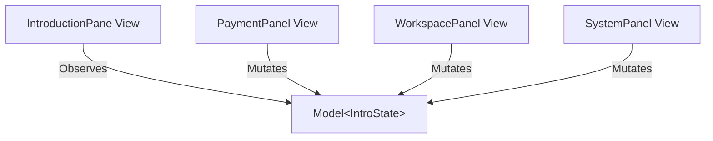

# Refactoring Plan: Migrating to a Unified GPUI Model

This document outlines the architectural plan to migrate the Gallery Introduction Pane from manually synchronized, duplicated local state variables to a central **GPUI Model (`Model<IntroState>`)**.

---

## The Problem
Currently, the state variables (e.g., `name_value`, `email_value`, `budget`) are duplicated in multiple places:
1. Local fields in sub-panels (e.g., `PaymentPanel`).
2. Local fields in the parent `IntroductionPane`.
3. Event payload definitions (e.g., `AppEvent::PaymentChanged`).

As more panels are added, this approach leads to:
* High state duplication.
* Large event routing match blocks in `pane.rs`.
* Significant boilerplate in event propagation.

---

## The Solution: A Hoisted GPUI Model
We will create a unified `IntroState` struct and wrap it in a single reactive GPUI Model (`Model<IntroState>`). Sub-panels mutate this model directly, and the parent pane observes the model to auto-sync calculations (like progress completion) and trigger page re-renders.



---

## Implementation Details

### 1. Unified State Definition
Create a new file `apps/gallery/src/gallery/panes/introduction/state.rs` containing the raw application state and self-contained helpers:

```rust
use gpui::SharedString;

#[derive(Default)]
pub struct IntroState {
    // Form fields
    pub name_value: SharedString,
    pub email_value: SharedString,
    pub payment_selection_set: bool,
    pub same_as_shipping: bool,
    pub default_payment_method: bool,
    pub accepted_terms: bool,
    pub social_source: bool,
    pub referral_source: bool,
    pub two_factor_enabled: bool,
    pub workspace_layout: SharedString,
    pub workspace_density: SharedString,
    pub workspace_icon_demo: SharedString,
    pub workspace_action: SharedString,
    
    // Stats & metadata
    pub budget: f32,
    pub clicks_submit: usize,
    pub clicks_cancel: usize,
    pub last_event: SharedString,
}

impl IntroState {
    pub fn compute_completion(&self) -> f32 {
        let mut score = 0.0f32;
        let mut max_score = 0.0f32;

        max_score += 1.0;
        if !self.name_value.is_empty() { score += 1.0; }
        
        max_score += 1.0;
        if !self.email_value.is_empty() { score += 1.0; }

        max_score += 1.0;
        if self.payment_selection_set { score += 1.0; }

        max_score += 1.0;
        if self.accepted_terms { score += 1.0; }

        max_score += 1.0;
        if self.two_factor_enabled { score += 1.0; }

        max_score += 1.0;
        if self.social_source || self.referral_source { score += 1.0; }

        max_score += 1.0;
        if !self.workspace_density.is_empty() && self.workspace_density.as_ref() != "None" {
            score += 1.0;
        }

        max_score += 1.0;
        score += self.budget / 100.0;

        if max_score > 0.0 { (score / max_score) * 100.0 } else { 0.0 }
    }
}
```

---

### 2. Modifying the Parent view (`IntroductionPane`)
Remove the redundant state fields and reference-count the model. Subscribe to its updates in `pane.rs`:

```rust
pub(in crate::gallery) struct IntroductionPane {
    // Hold the single reactive state container
    state: Model<IntroState>,

    // Sub-panels
    payment_panel: Entity<PaymentPanel>,
    workspace_panel: Entity<WorkspacePanel>,
    system_panel: Entity<SystemPanel>,
}

impl IntroductionPane {
    pub(in crate::gallery) fn new(cx: &mut Context<GalleryApp>, radix_theme: Arc<RadixTheme>) -> Self {
        // Initialize the model
        let state = cx.new_model(|_| IntroState::default());

        // Pass it to child entities
        let payment_panel = cx.new(|cx| PaymentPanel::new(cx, radix_theme.clone(), state.clone()));
        let workspace_panel = cx.new(|cx| WorkspacePanel::new(cx, radix_theme.clone(), state.clone()));
        
        let initial_completion = state.read(cx).compute_completion();
        let system_panel = cx.new(|cx| SystemPanel::new(cx, radix_theme.clone(), state.clone(), initial_completion));

        Self {
            state,
            payment_panel,
            workspace_panel,
            system_panel,
        }
    }

    pub(in crate::gallery) fn subscribe(&self, cx: &mut Context<GalleryApp>, subscriptions: &mut Vec<Subscription>) {
        // Automatically re-render parent pane when any child updates the model
        subscriptions.push(cx.observe(&self.state, |this, _model, cx| {
            // Update dependent fields (e.g. system progress bar)
            let completion = this.state.read(cx).compute_completion();
            this.system_panel.update(cx, |panel, cx| {
                panel.set_completion(completion, cx);
            });
            
            cx.notify();
        }));
    }
}
```

---

### 3. Modifying Child Panels (e.g., `PaymentPanel`)
Declare the sub-panels to hold `Model<IntroState>` instead of local fields:

```rust
declare_form! {
    pub(super) struct PaymentPanel {
        controls: {
            submit_button: Entity<Button> = radix_theme.primary_button("intro-submit").label("Submit")
                => ButtonEvent |this, _event, cx| {
                    this.state.update(cx, |state, cx| {
                        state.clicks_submit += 1;
                        state.last_event = "Button::Submit".into();
                        cx.notify();
                    });
                },
            // ... (other controls)
        },
        args: {
            radix_theme: Arc<RadixTheme>,
            state: Model<IntroState>,
        },
        fields: {} // local state fields are deleted
    }
}

impl PaymentPanel {
    fn handle_textfield_event(&mut self, field: PaymentField, event: &TextFieldEvent, cx: &mut Context<Self>) {
        if let TextFieldEvent::Change { value } = event {
            let next_value: SharedString = value.clone().into();
            
            // Mutate the hoisted state directly
            self.state.update(cx, |state, cx| {
                match field {
                    PaymentField::Name => state.name_value = next_value,
                    PaymentField::Email => state.email_value = next_value,
                }
                state.last_event = "TextField::Change".into();
                cx.notify();
            });
        }
    }
}
```

---

## Why This Migration Matters
1. **Removes the EventBus:** Deletes large enum message payloads and custom dispatch logic.
2. **Standardizes Data Flow:** Replaces bidirectional manually synchronized state with unidirectional reactive updates.
3. **Implements Single Source of Truth:** Changes to the form are written directly to the domain layer and seamlessly reflected down back to the UI views.

---

## Future Work: The "Application Service" Pattern
For complex applications where views might be loaded dynamically, nested deeply, or instantiated in different parts of the workspace, we can elevate local model hoisting to a global **Application Service** using GPUI's built-in global context registry (`gpui::Global`).

This eliminates constructor "prop-drilling" (passing the `Model<IntroState>` down manually) and decouples background tasks (like API requests, database writes, or file sync) from view lifecycles.

### 1. Implement `gpui::Global` on the Service
```rust
use gpui::{Global, Model};

pub struct IntroductionService {
    pub state: Model<IntroState>,
}

impl Global for IntroductionService {}
```

### 2. Registering the Service
At app startup or view initialization, register the service as a global resource:
```rust
pub(in crate::gallery) fn new(cx: &mut Context<GalleryApp>, radix_theme: Arc<RadixTheme>) -> Self {
    let state = cx.new_model(|_| IntroState::default());
    
    // Register the service globally
    cx.set_global(IntroductionService {
        state: state.clone(),
    });

    // Sub-panels no longer need to accept the model as a constructor argument!
    let payment_panel = cx.new(|cx| PaymentPanel::new(cx, radix_theme.clone()));
    let workspace_panel = cx.new(|cx| WorkspacePanel::new(cx, radix_theme.clone()));
    let system_panel = cx.new(|cx| SystemPanel::new(cx, radix_theme.clone()));

    Self {
        payment_panel,
        workspace_panel,
        system_panel,
    }
}
```

### 3. Fetching and Mutating Globally
Child views fetch the service dynamically from the context (`cx.global::<T>()`):
```rust
impl PaymentPanel {
    fn handle_textfield_event(&mut self, field: PaymentField, event: &TextFieldEvent, cx: &mut Context<Self>) {
        if let TextFieldEvent::Change { value } = event {
            let next_value: SharedString = value.clone().into();
            
            // Query the global registry
            let service = cx.global::<IntroductionService>();
            
            service.state.update(cx, |state, cx| {
                match field {
                    PaymentField::Name => state.name_value = next_value,
                    PaymentField::Email => state.email_value = next_value,
                }
                cx.notify();
            });
        }
    }
}
```

### 4. Background Coordination (The "Server" Aspect)
The service handles asynchronous operations using `cx.spawn()`, isolating database or network latency from the UI layer:
```rust
impl IntroductionService {
    pub fn save_payment_details(&self, cx: &mut WindowContext) {
        let state = self.state.read(cx);
        let payload = (state.name_value.clone(), state.email_value.clone());

        // Spawn independent background task
        cx.spawn(|mut cx| async move {
            // Simulated network delay
            smol::Timer::after(std::time::Duration::from_secs(2)).await;
            
            // Save data to server / local storage...
            
            // Update UI state upon completion
            cx.update(|cx| {
                let service = cx.global::<IntroductionService>();
                service.state.update(cx, |state, cx| {
                    state.last_event = "Saved to Server".into();
                    cx.notify();
                });
            }).ok();
        })
        .detach();
    }
}
```

