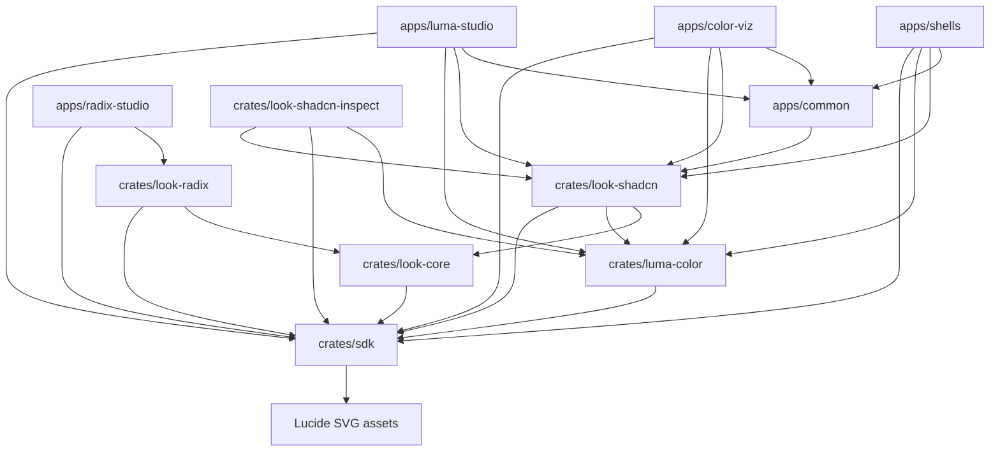

# GPUI-Luma Architecture Guide

This document defines the core architecture, crate layout, module mapping, and design principles of the `luma` workspace. It serves as the canonical source of truth for both human developers and AI assistants.

---

## 1. Project Scope & Workspace Structure

`luma` is a GPUI-based reusable component SDK. Downstream applications (such as Luma Studio) are consumers that compose these SDK controls, rather than inventing their own interactive chrome.

### Workspace Crates

*   **`crates/sdk` (`gpui-luma-sdk`, rustc crate `luma`)**: The styling-agnostic component SDK containing core controls (buttons, inputs, sliders, scrollbars, context menus, layout panels). Advanced color controls live in `luma-color`.
*   **`crates/luma-color` (`gpui-luma-color`, rustc crate `luma_color`)**: Color-domain controls built on the SDK slider engine — `color_slider`, `color_field`, `color_ring`, `color_arc`, swatch, chrome tokens, and composition sync helpers. Depends on `luma`; themed via look `sync_color_control_theme` / `with_look`.
*   **`crates/lucide-svg-static`**: Experimental generated-style, renderer-neutral Lucide SVG asset crate. It currently packages the three chevrons used by the SVG rotation spike; the intended follow-up is automated generation from pinned upstream Lucide releases.
*   **`crates/look-core` (`gpui-luma-look-core`, rustc crate `luma_look_core`)**: Thin look-agnostic contracts — resolved color/metric/typography values and provenance sources (`Authored`, `ScaleStep`, …). No CSS parsing, no control factories. See [`docs/look-boundary-inventory.md`](look-boundary-inventory.md) and crate docs for how to author a look without editing the SDK.
*   **`crates/look-shadcn` (`gpui-luma-look-shadcn`, rustc crate `luma_look_shadcn`)**: Shadcn look **runtime** — CSS catalog parsing, `style.toml` recipe matching, and look-specific control factories. Callers supply CSS via `ShadcnLook::from_css_str` (or a path). It does not embed tweakcn theme packs. Depends on `look-core` for shared provenance shapes (Shadcn still owns its CSS-shaped `ResolvedColor` until a later migration).
*   **`crates/look-radix` (`gpui-luma-look-radix`, rustc crate `luma_look_radix`)**: Minimal Radix-shaped look stub — dual 12-step **color** + **gray** scales (plus destructive), semantic role mapping, `page_background()` (color #3 → gray #1), `signup_stage()` + Skia-rasterized signup mesh (`rasterize_signup_mesh_*` → cached `RenderImage`), and theme adapters for button, textfield, checkbox, switch, toggle, tabs, popup menu, and overlay window via `RadixLookControlExt`. Proves a second look can theme SDK primitives without SDK API changes.
*   **`crates/look-shadcn-inspect` (`gpui-luma-look-shadcn-inspect`, rustc crate `luma_look_shadcn_inspect`)**: Support utilities for theme visual inspection and palette debugging.
*   **`apps/common` (`luma-app-common`)**: Shared demo assets for Studio, shells, and color-viz — embedded tweakcn CSS packs plus fonts those themes reference, with GPUI registration helpers. Not an SDK crate; production apps supply their own CSS and fonts. Look-crate tests keep a small local CSS fixture set instead of depending on this package.
*   **`apps/luma-studio` (`luma-studio`)**: Shadcn-focused integration workbench (control docs, theme inspection, color compositions). Not a product app. System font classification for typography pickers lives in `studio/font_catalog/`.
*   **`apps/radix-studio` (`luma-radix-studio`)**: Single-screen workbench for the `look-radix` stub — custom palette overview (mode toggle, seed hex displays, 12-step scales, control previews bound via `RadixLookControlExt`). Not a product app.
*   **`apps/color-viz` (`luma-color-viz`)**: GPUI platform-gap lab (e.g. P3 / shader limits) using Shadcn look and shared theme CLI — not the color product home.
*   **`apps/shells/`**: Full-window shell reference apps — `SplitView` recipes (unified, inset, icon-rail, detached, split-titlebar) plus `vscode` (Luma Studio `ResizablePanels` workbench shell) — with shared theme and, where applicable, the Properties `SidebarControl` sample from `apps/shells/common`.

### Crate Dependencies



---

## 2. Core Architectural Principles

### 2.1 Separation of Concerns (LMTP Split)
To maintain visual and behavioral flexibility, each control family is split into four distinct boundaries:
1.  **Model (`model.rs`)**: The builder and static configuration payload. It defines what options the caller can configure and is cheap and side-effect-free to construct.
2.  **Control (`control.rs`)**: The live GPUI entity (`cx.new(..)`). It owns runtime interaction state, coordinates input and focus events, manages validation, and triggers rendering updates with `cx.notify()`.
3.  **Template (`template.rs`)**: The presentation engine. It turns a readonly render model snapshot into concrete GPUI elements (`Div`). It is stateless and does not handle business logic or modify control states directly. Templates support standardized seams for styling and layout overrides. For selection-style controls built on `control_group`, callers that only need custom item layout should use `with_item_layout(...)` and arrange SDK-provided item elements with normal containers such as `vstack!` or `hstack!`; custom group templates are reserved for changing the interaction chrome itself.
4.  **Theme (`theme.rs` or Look Crate)**: Resolves semantic parameters (interaction layer, size, styling variants) into concrete values (colors, margins, borders).

### 2.2 The Customization Ladder
To customize a control, developers must follow the customization hierarchy:
1.  **Modifier (First Tier)**: Apply minor structural or chrome tweaks (margins, borders, padding, overlays) to the existing template root via `.with_template_modifier(...)`.
2.  **Derived Template (Second Tier)**: Implement/replace the template trait for larger rendering or structural changes that still preserve the control's interaction contract.
3.  **Derived Theme/Look (Third Tier)**: Derive/extend look-level styling rules for family-wide defaults or metric overrides.

### 2.3 Lookless SDK Core
The SDK core (`crates/sdk`) is lookless. It does not hardcode theme colors (like hex codes or HSLA values), paddings, or border-radii. Instead, it queries layout metrics from cached scales (e.g., `StandardBoxScale`, `ListRowScale`) and delegates state resolution to look-defined themes. This decouples behavior from design systems, allowing Shadcn or another downstream look to be hot-swapped without modifying SDK controls.

### 2.4 Typed Boundaries
APIs utilize strongly typed contracts rather than strings:
*   Use `ControlSize::Md` instead of `"medium"`.
*   Pass typed icon markers (e.g. `lucide_svg_static::Icon` from the `lucide-static-svg` package or explicit SVG paths) instead of magic string names.
*   Avoid arbitrary string-to-token parsing within the SDK core.

### 2.5 SDK/App Boundary
Apps under `apps/` must **only compose** SDK controls using builders and factories (such as `ShadcnLookControlExt` methods).
*   **Allowed in apps:** Routing, domain models, page compositions, section containers, and static text.
*   **Not allowed in apps:** Inventing alternative buttons, checkboxes, text fields, or custom focus/hover overlays using raw `div` styles.

---

## 3. Crate & Module Map

### `crates/sdk` Module Architecture
*   [`init.rs`](file:///Users/scg/Developer/GitHub/luma/crates/sdk/src/init.rs): Global SDK initialization hook.
*   [`focus.rs`](file:///Users/scg/Developer/GitHub/luma/crates/sdk/src/focus.rs): Focus scopes, key binders, and focus-traversal helpers.
*   [`key_handling.rs`](file:///Users/scg/Developer/GitHub/luma/crates/sdk/src/key_handling.rs): Core key profile definitions and action bindings.
*   [`layouts/`](file:///Users/scg/Developer/GitHub/luma/crates/sdk/src/layouts): Primitive layout stacks — `DockPanel`, `GridLayout`, `LayerStack`, `WideMiddle` / `WideMiddleLayout` (measure-aware leading|middle|trailing; middle is hard-capped in the three-column row via `middle_max_width`, sides take leftover flex; when mins no longer fit, middle reorders onto its own full-width row). `LayerStack` does not provide a rounded descendant clip; painted descendants must own the matching boundary.
*   [`macros.rs`](file:///Users/scg/Developer/GitHub/luma/crates/sdk/src/macros.rs): Layout convenience macros (`vstack!`, `hstack!`, `grid_layout!`, `flow!`) and forms (`declare_form!`).
*   [`prelude.rs`](file:///Users/scg/Developer/GitHub/luma/crates/sdk/src/prelude.rs): Small shared import surface — builders, events, `ControlSize`, `InteractionState`, `IconSource`. Family modules remain the source of templates and themes.
*   [`theme/`](file:///Users/scg/Developer/GitHub/luma/crates/sdk/src/theme): Global layout caches (`cache.rs`), metric scales (`scales.rs`), and token structures split as `tokens::{palette, metrics, typography, elevation}` (`ControlSize` / `ThemeMode` stay on `tokens`). `luma::prelude` re-exports builders, events, `ControlSize`, `InteractionState`, and `IconSource`.
*   [`infra/`](file:///Users/scg/Developer/GitHub/luma/crates/sdk/src/infra): Shared LMTP seams and chrome that are not spawnable controls — [`template.rs`](file:///Users/scg/Developer/GitHub/luma/crates/sdk/src/infra/template.rs) (modifiers), [`state.rs`](file:///Users/scg/Developer/GitHub/luma/crates/sdk/src/infra/state.rs) (focus/composite states), [`presenter.rs`](file:///Users/scg/Developer/GitHub/luma/crates/sdk/src/infra/presenter.rs), [`value.rs`](file:///Users/scg/Developer/GitHub/luma/crates/sdk/src/infra/value.rs) (numeric ranges), [`element_ext.rs`](file:///Users/scg/Developer/GitHub/luma/crates/sdk/src/infra/element_ext.rs) (`ElementExt` / `StyledExt`), [`arc_shape.rs`](file:///Users/scg/Developer/GitHub/luma/crates/sdk/src/infra/arc_shape.rs) (shared arc path helpers), [`icon.rs`](file:///Users/scg/Developer/GitHub/luma/crates/sdk/src/infra/icon.rs) (look-agnostic `IconSource` plus shared `DisclosureIcons` / `SelectionStatusIcons`), [`field_label.rs`](file:///Users/scg/Developer/GitHub/luma/crates/sdk/src/infra/field_label.rs), [`shadow_layout.rs`](file:///Users/scg/Developer/GitHub/luma/crates/sdk/src/infra/shadow_layout.rs), [`rounded_shell.rs`](file:///Users/scg/Developer/GitHub/luma/crates/sdk/src/infra/rounded_shell.rs), [`menu_item.rs`](file:///Users/scg/Developer/GitHub/luma/crates/sdk/src/infra/menu_item.rs).
*   [`motion/`](file:///Users/scg/Developer/GitHub/luma/crates/sdk/src/motion): Shared frame-driven primitives — `VisualTransition`, `DisclosureMotion`, `ContinuousPhase`, `OverlayPresence`, and `PopupLifecycle`. Crate root re-exports the motion primitives. Controls own transitions and drive them with `sync` + `cx.on_next_frame`.
*   [`controls/`](file:///Users/scg/Developer/GitHub/luma/crates/sdk/src/controls): Spawnable control families, grouped as `button/`, `choice/`, `text/`, `overlay/`, `selection/`, `navigation/`, `layout/`, and `range/`. `luma::controls::<family>` paths remain (e.g. `controls::checkbox` is `controls::choice::checkbox`):
    *   **Buttons:** `controls::button` owns the LMTP button (`control`/`model`/`template`) plus `CommandCore` activation semantics, `icon_button`, and `button::family` (also re-exported as `button_family`). `split_button` is a `PopupMenu` preset (type aliases only — not a separate LMTP control); callers can configure distinct `open_trigger_icon` and `close_trigger_icon` values. `icon_group` is the module and look factory (`look.icon_group()`).
    *   **Choice:** `checkbox`, `radio_button`, `switch`, `toggle`, `control_group` (selection engine with explicit active-descendant focus by default, opt-in roving-item focus targets, and opt-in animated selection progress for compatible item templates; checkbox, ListBox, SelectionPanel, and Stepper affordances accept shared `SelectionStatusIcons`; menu-choice rows expose resolved item visual context via `ControlGroupItemVisualContext` and `with_menu_row_item_content`).
    *   **Composition:** `toolbar` (`Toolbar = Entity<ToolbarControl>`; thin `control_group` specialization with horizontal layout, configurable focus strategy defaulting to `RovingItemFocus`, hosted items + separators, `Outline`/`Ghost` shell variants, unified `ToolbarEvent` fan-in from sourced child controls, and optional item-level click/change callbacks). Look-bound item factories live on `ShadcnToolbarItemExt` (`toolbar_button`, `toolbar_toggle`, `toolbar_textfield`, …).
    *   **Inputs:** `textfield`, `textarea`, `text/` (shared editing engine).
    *   **Layout:** `dock_splitter`, `split_view` (sidebar expand/collapse is animated by default and can be disabled with `.animated(false)`), `resizable_panels`, `scrollbar` (`ScrollbarViewport` maps abstract content/visible ranges onto internal value and thumb geometry), `scroll_container` (styled viewport + scrollbar host with `ScrollbarPlacement::{Inset, Overlay}`, `ScrollbarVisibility::{AlwaysVisible, AutoHide, Hidden}`, and `ScrollbarAutoHideActivate::{Hover, Move, HoverOrMove}`).
    *   **Range input:** `slider` (unified single- and multi-thumb engine with linear/angular strategies, optional value-position mapping, and `DomainTrackRenderer`; programmatic/`set_value` and keyboard changes lerp thumb + active fill via `VisualTransition`, while pointer drag snaps display 1:1). Color-domain adapters (`ColorSliderBuilder`, `ColorArcBuilder`, `ColorRingBuilder`, field, swatch, composition sync) live in `luma_color`, not the SDK.
    *   **Selection:** Three distinct roles — `selector` (popup dropdown), `selection_panel` (listbox-in-a-panel spawnable), `selector_list` (shared item-list chrome for selector/combobox/autocomplete; **not** a control). Also `autocomplete` (`Autocomplete` / `AutocompleteEvent`), `combobox`, `search_selector`, `list_view`. Selector trigger themes receive `InteractionState` plus the selector-owned `SelectorVisualState` (open and selected), so trigger chrome can resolve explicit state precedence without an adorner or generic overlay system. Per-control `*State` aliases of `InteractionState` were removed.
    *   **Menus & overlays:** `popup_menu`, `context_menu` (animated root and nested flyout entry using shared `OverlayPresence`; close remains immediate to avoid staged teardown; caller-owned target content uses an explicit full-size host for reliable hit testing), `floating_menu` (**renderer only** — `model`/`template`/`theme` for menu list chrome; no spawnable entity; used by popup/context menus), `popover_button` (trigger-owned public popover with LMTP files plus a private `panel/` engine), `overlay_window` (thin modal/modeless window-hosting primitive with deferred window-hosted presentation, dismiss/focus lifecycle in `control.rs`, and caller-owned content composition), `slide_panel` (app-owned drawer: `model` + `template/` including resize-handle chrome; no spawnable entity — apps own `SlidePanelState` and call overlay templates). `popup_scroll_surface` stays next to `scroll_container` because it hosts a scrollbar.
    *   **Navigation:** `sidebar` (`SidebarControl` with modern `sidebar_group` / `sidebar_menu` builders; flush list presentation engine lives under `sidebar/engine`; themed `SidebarTemplate` owns optional inset-pane radius, background, and descendant clipping), `tabs` (`look.tabs()`; types are `Tabs*`; control-group-backed tabs with controlled button-family toggle item rendering, dropdown trigger events, anchor reporting, list-level active indicator that lerps position/width via `VisualTransition`, and reusable item-render / same-root overlay host helpers with `OverlayPresence` enter/exit for derived templates), `accordion`, `listbox`, `list_view` (`ListView` is the entity type; the `ScrollingListView` alias was removed), `pager` (typed `PagerIcons` configure page-size and first/previous/next/last affordances), `progress` (`set_value` interpolates fill via `VisualTransition`; indeterminate mode uses looping `ContinuousPhase` shimmer/sweep), `tree_view` (branch expand/collapse lerps descendant row heights via per-node `VisualTransition` with delayed collapse splice-out, and rotates the branch chevron `0°→90°`), `stepper` (active-step indicator track fill lerps via `VisualTransition`; optional step content slots slide in a clipped panel host).

    Public callers should use `popover_button` for trigger-owned popovers; its placement and popup lifecycle implementation is private to that control.

*   **Semantic icon decisions:** TextArea exposes its draggable resize-handle icon through `TextAreaBuilder::resize_handle_icon`; Selector item checkmarks share `SelectorIcons::selected`; and shell title-bar minimize, maximize/restore, and close glyphs remain fixed platform chrome. The title-bar controls map directly to native window control areas and actions, so a shared SDK icon contract would add customization surface without improving behavior or accessibility semantics. Caller-owned content icons and fixed decorative affordances (such as pager ellipses and text-entry clear/search glyphs) remain outside the semantic icon configuration surface.

### `crates/luma-color` Module Architecture
*   Package `gpui-luma-color` / rustc `luma_color`. Depends on `luma` (generic `Slider`, button templates, theme tokens, infra).
*   **Core elements:** `color_slider`, `color_field`, `color_ring`, `color_arc` (builders return unified `Slider` entities where applicable), `swatch`, `chrome_tokens`, `style` (`ColorControlTheme` + sizing), `composition` (`ColorCompositionSync`, `CompositionSize`).
*   Look integration: `look-shadcn` calls `sync_color_control_theme` inside `with_look` so color chrome tracks the active theme.
### `crates/look-shadcn` Module Architecture
*   [`look.rs`](file:///Users/scg/Developer/GitHub/luma/crates/look-shadcn/src/look.rs): Holds the parsed CSS token database and mapping configurations. CSS is supplied by the caller (`from_css_str` / `from_css_path`); demo tweakcn packs live in `apps/common`.
*   [`controls/ext.rs`](file:///Users/scg/Developer/GitHub/luma/crates/look-shadcn/src/controls/ext.rs): Implements `ShadcnLookControlExt` for spawning look-bound control builders.
*   [`stylesheet/`](file:///Users/scg/Developer/GitHub/luma/crates/look-shadcn/src/stylesheet): Stylesheet matching configuration and resolvers:
    *   `config.rs`: Strongly deserialized Serde layouts for mapping styles to `style.toml`.
    *   `resolve.rs`: Layout metric calculations, variables (`@field`), and opacity resolver.
*   [`ext.rs`](file:///Users/scg/Developer/GitHub/luma/crates/look-shadcn/src/ext.rs): Layout extension modifiers (`bg_cn`, `text_cn`, `gap_cn`, `shadow_cn`).
*   **Elevation:** Control/container shadows resolve from `[[*.elevation_rules]]` in `assets/style.toml` → catalog `--shadow-*` tokens → look fields → template `.shadow()`. Shadows paint outside the logical control bounds and do not reserve layout space; focus-ring geometry remains reserved where needed so focus does not shift layout. App chrome may use `div().shadow_cn(ShadcnShadow::…)` inside `with_look`.

### `apps/luma-studio` Experimental Layout Prototypes
*   `studio/prototypes/flex_layout.rs`: App-local responsive flow prototype retained for Luma Studio experimentation and not part of the SDK surface.
*   `studio/prototypes/column_layout.rs`: App-local estimated masonry / column-packing prototype retained for Luma Studio experimentation and not part of the SDK surface.
*   `studio/content_tabs/cards/`: Cards-tab board composition and app-local layout tuning layered on top of the experimental layout prototypes.
*   `studio/doc_shell/`: Shared scrollable-doc chrome (sticky section headings, anchored headings) used by the Style Guide tab.
*   `studio/controls/`: SDK control documentation panel for the Controls content tab — component catalog picker opens as a popup when the tab is selected or re-activated; choosing an item closes it and shows that exposition below (`ControlDocCard`, catalog entries, live previews). Includes app-local `EventLogView` (LMTP split: read-only scrollable log display for event demos). Viewport-filling exposition pages that pair left-side details with a right-side inspector should use the shared `InspectorSplitShell`, with the Controls host providing measured viewport size via the exposition registry. **Shadcn theme inspection** uses the generic `ThemeInspector` control fed by per-control `ControlInspectorSpec` metadata and a `ControlInspectorResolver` adapter. Composite controls declare nested **parts** (for example Popup Menu trigger vs panel) via `InspectorPart`; simple controls use flat **variants** when `parts` is empty. **Color chrome inspection** is separate: `ColorChromeInspector` resolves theme-derived border/background/overlays/thumb defaults via `ColorChromeProfile` slices from `look-shadcn-inspect` (`inspect_color_chrome_sections`), with SDK-owned literals centralized in `color::chrome_tokens`; the app adapter in `inspector/color_chrome.rs` maps `ResolvedColor`/`ResolvedMetric` rows into studio UI. Color Slider, Color Field, Color Ring, and Color Arc wire `spawn_color_chrome_viewport` today; other color catalog entries can follow the same split pattern. Wired Shadcn theme inspectors today: Button, Toggle, Checkbox, Radio Button, Switch, TextField, TextArea, Selector, ComboBox, Autocomplete, SearchSelector, Badge, Progress, Stepper, Slider, Scrollbar, Floating Menu, Popup Menu, Split Button, Context Menu, ListBox, ListView, Selection Panel, TreeView, Sidebar Control, Tabs Navigation, Toolbar, Pager, Accordion, Resizable Panels, and Split View / Dock Panel. Shared inspector data helpers under `control_exposition/inspector/` (`provenance`, `metrics`, `occupation`, `box_model`, `input`, `collection`, `color_chrome`) provide metric/color/box-model resolution without the old tree/detail UI. Distinct from `studio/style/`, which focuses on theme/visual inspection (variant matrices, customization ladders).

---

## 4. Event & State Communication Boundaries

Luma uses a reactive, parent-child model for UI updates, adhering strictly to GPUI conventions:

```text
User Actions (Pointer/Keyboard)
         ↓
   Control Entity (control.rs) --- updates state ---> notify (re-render)
         ↓
   Emits Semantic Event (cx.emit)
         ↓
   App Coordinator/Parent Crate (cx.subscribe) --- updates model ---> updates children
```

### Event Invariant
*   **Dropdown-capable tabs** emit `TabsEvent::DropdownRequested { tab_id, label, bounds }` after reactivation, letting apps open an anchored panel without inferring dropdown intent from raw activation events.
*   **Controls** emit semantic events (e.g. `ButtonEvent::Click`, `ButtonEvent::FocusChanged`, `ButtonEvent::HoverChanged`, `ButtonEvent::EnabledChanged`, `SplitButtonEvent::ActionClick`, `SplitButtonEvent::Select { item_id, label }`, `SplitButtonEvent::OpenChanged`, `SplitButtonEvent::Dismiss`, `CheckboxEvent::Change { checked }`, `SwitchEvent::Change { on }`, `ToggleEvent::Change { selected }`, `RadioButtonEvent::Change { selected }`, `RadioGroupEvent::Change { value }`, `ControlGroupEvent::Change`, `ControlGroupEvent::Activate`, `ControlGroupEvent::ItemBoundsChanged`, `ControlGroupEvent::FocusChanged`, `ControlGroupEvent::ItemFocused`, `TabsEvent::Change { tab_id, label }`, `TabsEvent::Activate { tab_id, label }`, `TabsEvent::Reactivate { tab_id, label }`, `TabsEvent::ItemBoundsChanged { tab_id, bounds }`, `TabsEvent::FocusChanged`, `SidebarEvent::OpenChanged { open, collapsible }`, `SidebarEvent::Select { id }`, `SidebarEvent::SubMenuToggle { id, open }`, `SidebarEvent::ItemFocused { id }`, `SidebarEvent::HoverChanged { id }`, `SidebarEvent::Dismissed`, `SidebarEvent::EnabledChanged { enabled }`, `AccordionEvent::ExpandedChanged { item_id, expanded }`, `AccordionEvent::FocusChanged`, `AccordionEvent::ItemFocused`, `PagerEvent::PageChanged { page }`, `PagerEvent::PageSizeChanged { page_size }`, `PagerEvent::PageSizeOpenChanged`, `ListViewEvent::SelectionChanged { selected_indices }`, `ListViewEvent::ActiveIndexChanged { active_index }`, `ListViewEvent::ScrollChanged { top_index }`, `ListViewEvent::FocusChanged`, `TreeViewEvent::NodeExpanded { node_id, data }`, `TreeViewEvent::NodeCollapsed { node_id, data }`, `TreeViewEvent::SelectionChanged { selected_ids }`, `TreeViewEvent::ActiveNodeChanged { node_id }`, `TreeViewEvent::FocusChanged`, `SelectorEvent::Change { item_id, label }`, `SelectorEvent::FocusChanged`, `SelectorEvent::OpenChanged`, `SelectorEvent::Dismiss`, `SelectionPanelEvent::ActivateRow`, `SelectionPanelEvent::ActiveIndexChanged`, `SelectionPanelEvent::FocusChanged`, `SelectionPanelEvent::OpenChanged`, `SearchSelectorEvent::Change { query }`, `SearchSelectorEvent::Select { item_id, label }`, `ComboBoxEvent::Change { query }`, `ComboBoxEvent::Select { item_id, label }`, `AutocompleteEvent::Change { query }`, `AutocompleteEvent::Select { item_id, label }`, `TextFieldEvent::Change { value }`, `TextFieldEvent::FocusChanged { focused }`, `TextAreaEvent::Change { value }`, `TextAreaEvent::FocusChanged { focused }`, `SliderEvent::Change { thumb_id, value }`, `SliderEvent::Release { thumb_id, value }`, `SliderEvent::DragStart { thumb_id }`, `SliderEvent::DragEnd { thumb_id, value }`, `ColorFieldEvent::Change`, `ColorFieldEvent::Release`, `ColorFieldEvent::DragStart`, `ColorFieldEvent::DragEnd`, `ScrollbarEvent::Change { value }`, `ScrollbarEvent::DragStart`, `ScrollbarEvent::DragEnd { value }`, `PopupMenuEvent::Select { item_id, label }`, `PopupMenuEvent::OpenChanged`, `PopupMenuEvent::Dismiss`, `ContextMenuEvent::Select { item_id, label }`, `ContextMenuEvent::OpenChanged`, `ContextMenuEvent::Dismiss`, `OverlayWindowEvent::Opened`, `OverlayWindowEvent::Dismissed`, `SplitViewEvent::SidebarWidthChanged`, `SplitViewEvent::ResizeStart`, `SplitViewEvent::ResizeEnd`, `ResizablePanelsEvent::SizesChanged`, `ResizablePanelsEvent::ResizeStart`, `ResizablePanelsEvent::ResizeEnd`, `DockSplitterEvent::Resize`; multi-thumb sliders may also emit `ThumbAdded`, `ThumbRemoved`, `ThumbSelected`).
*   **Templates** never emit events. They register element event listeners to call control methods, which in turn emit the semantic events.
*   Button presenter content receives the `ButtonRenderModel` with the active template's resolved `ButtonFamilyLook` in `resolved_look`; custom icons should use that explicit foreground rather than attempting to inherit color from a parent element. SVG icon renderers must set `text_color` directly on the SVG.
*   **Application states** never live inside SDK controls. Apps subscribe to control events using `cx.subscribe` and sync their local models accordingly. Programmatic value setters (e.g., `set_value`) update visual state and notify, but do **not** trigger recursive value events to avoid update loops. Idempotent lifecycle setters may emit explicit lifecycle transitions such as `EnabledChanged`.
*   **Public SDK event enums are non-exhaustive.** Consumers must match only the variants they handle and include a wildcard arm or use `if let` / `let ... else`. Adding a new lifecycle or semantic event must not force an exhaustive-match refactor across downstream apps.
*   **Boolean choice controls** (`Checkbox`, `Switch`, `Toggle`, `RadioButton`) own their click-to-value transition in the SDK. Apps subscribe to `CheckboxEvent::Change`, `SwitchEvent::Change`, `ToggleEvent::Change`, or `RadioButtonEvent::Change` and assign their local model from the event payload. Use `set_data` only for programmatic synchronization; do not subscribe to an inner `ButtonEvent` or flip raw `Button<bool>` state in app code.

### Composed controls & demo event logs (Luma Studio)
Composed controls such as `autocomplete`, `combobox`, and `search_selector` wrap textfield and popup child controls, but their public semantic events follow the same SDK contract as simpler controls: update owned state, emit with `cx.emit(...)`, and notify as needed. Luma Studio event-log demos should retain subscriptions on the preview entity and lay out popup-based controls so their overlays do not cover the event stream.

### Overlay Theme Invalidation
*   **`OverlayWindow`** observes [`LumaThemeRevision`](file:///Users/scg/Developer/GitHub/luma/crates/sdk/src/theme/revision.rs) and re-renders itself when the active look changes.
*   Persistent entities composed into overlay content (buttons, choice groups, etc.) must be registered on the builder via `.theme_child(...)` / `.theme_children([...])` so the overlay fans out invalidation without app-level notify plumbing.
*   Overlay content closures must resolve look-derived tokens at render time; do not capture colors or metrics from the look at spawn time.
