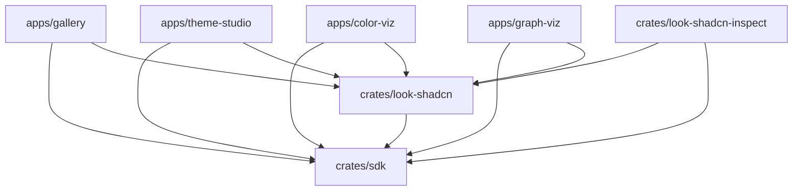

# GPUI-Luma Architecture Guide

This document defines the core architecture, crate layout, module mapping, and design principles of the `gpui-luma` workspace. It serves as the canonical source of truth for both human developers and AI assistants.

---

## 1. Project Scope & Workspace Structure

`gpui-luma` is a GPUI-based reusable component SDK. Downstream applications (such as the gallery and theme studio) are consumers that compose these SDK controls, rather than inventing their own interactive chrome.

### Workspace Crates

*   **`crates/sdk` (`gpui-luma`)**: The styling-agnostic component SDK containing core controls (buttons, inputs, sliders, scrollbars, context menus, layout panels).
*   **`crates/look-shadcn` (`gpui-luma-look-shadcn`)**: The CSS-first product runtime theme (Shadcn/CSS look crate). It defines styling catalogs, stylesheet config matching, and look-specific extensions.
*   **`crates/look-shadcn-inspect`**: Support utilities for theme visual inspection and palette debugging.
*   **`apps/gallery` (`gpui-luma-gallery`)**: The main showcase and interactive validation app for controls and styles.
*   **`apps/theme-studio` (`gpui-luma-theme-studio`)**: The theme customization dashboard and visual design testing studio. System font classification for typography pickers lives in `studio/font_catalog/`.
*   **`apps/color-viz` (`gpui-luma-color-viz`)**: Color visualization workspace (Shadcn look, same theme CLI as gallery).
*   **`apps/graph-viz` (`gpui-luma-graph-viz`)**: Graph visualization workspace with theme-studio workbench shell (theme sidebar + tabbed content).

### Crate Dependencies



---

## 2. Core Architectural Principles

### 2.1 Separation of Concerns (LMTP Split)
To maintain visual and behavioral flexibility, each control family is split into four distinct boundaries:
1.  **Model (`model.rs`)**: The builder and static configuration payload. It defines what options the caller can configure and is cheap and side-effect-free to construct.
2.  **Control (`control.rs`)**: The live GPUI entity (`cx.new(..)`). It owns runtime interaction state, coordinates input and focus events, manages validation, and triggers rendering updates with `cx.notify()`.
3.  **Template (`template.rs`)**: The presentation engine. It turns a readonly render model snapshot into concrete GPUI elements (`Div`). It is stateless and does not handle business logic or modify control states directly. Templates support a standardized modifier seam (`with_modifier` / `with_template_modifier`) to allow callers to apply styling overrides.
4.  **Theme (`theme.rs` or Look Crate)**: Resolves semantic parameters (interaction layer, size, styling variants) into concrete values (colors, margins, borders).

### 2.2 The Customization Ladder
To customize a control, developers must follow the customization hierarchy:
1.  **Modifier (First Tier)**: Apply minor structural or chrome tweaks (margins, borders, padding, overlays) to the existing template root via `.with_template_modifier(...)`.
2.  **Derived Template (Second Tier)**: Implement/replace the template trait for larger rendering or structural changes that still preserve the control's interaction contract.
3.  **Derived Theme/Look (Third Tier)**: Derive/extend look-level styling rules for family-wide defaults or metric overrides.

### 2.3 Lookless SDK Core
The SDK core (`crates/sdk`) is lookless. It does not hardcode theme colors (like hex codes or HSLA values), paddings, or border-radii. Instead, it queries layout metrics from cached scales (e.g., `StandardBoxScale`, `ListRowScale`) and delegates state resolution to look-defined themes. This decouples behavior from design systems, allowing themes (e.g., Radix, Shadcn) to be hot-swapped without modifying SDK controls.

### 2.4 Typed Boundaries
APIs utilize strongly typed contracts rather than strings:
*   Use `ControlSize::Md` instead of `"medium"`.
*   Pass typed icon markers (e.g. `lucide_icons::Icon` or explicit SVG paths) instead of magic string names.
*   Avoid arbitrary string-to-token parsing within the SDK core.

### 2.5 SDK/App Boundary
Apps under `apps/` must **only compose** SDK controls using builders and factories (such as `ShadcnLookControlExt` methods).
*   **Allowed in apps:** Routing, domain models, page compositions, section containers, and static text.
*   **Not allowed in apps:** Inventing alternative buttons, checkboxes, text fields, or custom focus/hover overlays using raw `div` styles.

---

## 3. Crate & Module Map

### `crates/sdk` Module Architecture
*   [`init.rs`](file:///Users/scg/Developer/GitHub/gpui-luma/crates/sdk/src/init.rs): Global SDK initialization (registers Lucide icon font bytes).
*   [`focus.rs`](file:///Users/scg/Developer/GitHub/gpui-luma/crates/sdk/src/focus.rs): Focus scopes, key binders, and focus-traversal helpers.
*   [`keyhandling.rs`](file:///Users/scg/Developer/GitHub/gpui-luma/crates/sdk/src/keyhandling.rs): Core key profile definitions and action bindings.
*   [`layout.rs`](file:///Users/scg/Developer/GitHub/gpui-luma/crates/sdk/src/layout.rs): Re-export surface for SDK layout primitives.
*   [`layouts/dock_panel.rs`](file:///Users/scg/Developer/GitHub/gpui-luma/crates/sdk/src/layouts/dock_panel.rs): `DockPanel` edge-docking layout and constraints.
*   [`layouts/grid_layout.rs`](file:///Users/scg/Developer/GitHub/gpui-luma/crates/sdk/src/layouts/grid_layout.rs): `GridLayout` flex-compiled column-track layout.
*   [`macros.rs`](file:///Users/scg/Developer/GitHub/gpui-luma/crates/sdk/src/macros.rs): Layout convenience macros (`vstack!`, `hstack!`, `grid_layout!`, `flow!`) and forms (`declare_form!`).
*   [`theme/`](file:///Users/scg/Developer/GitHub/gpui-luma/crates/sdk/src/theme): Global layout caches (`cache.rs`), metric scales (`layout.rs`), and token structures.
*   [`controls/`](file:///Users/scg/Developer/GitHub/gpui-luma/crates/sdk/src/controls): The control library:
    *   **Shared infra:** [`template.rs`](file:///Users/scg/Developer/GitHub/gpui-luma/crates/sdk/src/controls/template.rs) (modifiers), [`state.rs`](file:///Users/scg/Developer/GitHub/gpui-luma/crates/sdk/src/controls/state.rs) (focus/composite states), [`value.rs`](file:///Users/scg/Developer/GitHub/gpui-luma/crates/sdk/src/controls/value.rs) (numeric ranges).
    *   **Buttons:** `command/button`, `command/icon_button`, `button_family`.
    *   **Choice:** `checkbox`, `radio_button`, `switch`, `toggle`, `control_group` (selection engine).
    *   **Inputs:** `textfield`, `textarea`, `text/` (shared editing engine).
    *   **Layout:** `dock_splitter`, `split_view`, `resizable_panels`, `scrollbar`.
    *   **Range input:** `slider` (unified single- and multi-thumb engine with linear/angular strategies, optional value-position mapping, and `DomainTrackRenderer`), `color/color_slider` (`ColorSliderBuilder` returns unified `Slider` entities), `color/color_arc` (`ColorArcBuilder` returns unified `Slider` entities for angular spectrum arcs), `color/color_ring` (`ColorRingBuilder` returns unified `Slider` entities for circular spectrum rings while the legacy `ColorRingState` path remains available as a reference surface during migration), `color/composition` (small sync helpers plus shared `CompositionSize` sizing contracts for app-level color compositions that need coordinated slider/renderer refresh without a new framework).
    *   **Selection:** `autocomplete`, `combobox`, `search_selector`, `selector`, `selection_panel`.
    *   **Menus & overlays:** `popup_menu`, `context_menu`, `floating_menu`, `overlay_window` (thin modal/modeless window-hosting primitive with deferred window-hosted presentation, dismiss/focus lifecycle in `control.rs`, and caller-owned content composition).
    *   **Navigation:** `navigation_sidebar`, `tabs_navigation`, `accordion`, `listbox`, `list_view`, `pager`.

### `crates/look-shadcn` Module Architecture
*   [`look.rs`](file:///Users/scg/Developer/GitHub/gpui-luma/crates/look-shadcn/src/look.rs): Holds the parsed CSS token database and mapping configurations.
*   [`controls/ext.rs`](file:///Users/scg/Developer/GitHub/gpui-luma/crates/look-shadcn/src/controls/ext.rs): Implements `ShadcnLookControlExt` for spawning look-bound control builders.
*   [`stylesheet/`](file:///Users/scg/Developer/GitHub/gpui-luma/crates/look-shadcn/src/stylesheet): Stylesheet matching configuration and resolvers:
    *   `config.rs`: Strongly deserialized Serde layouts for mapping styles to `style.toml`.
    *   `resolve.rs`: Layout metric calculations, variables (`@field`), and opacity resolver.
*   [`ext.rs`](file:///Users/scg/Developer/GitHub/gpui-luma/crates/look-shadcn/src/ext.rs): Layout extension modifiers (`bg_cn`, `text_cn`, `gap_cn`).

### `apps/theme-studio` Experimental Layout Prototypes
*   `studio/prototypes/flex_layout.rs`: App-local responsive flow prototype retained for Theme Studio experimentation and not part of the SDK surface.
*   `studio/prototypes/column_layout.rs`: App-local estimated masonry / column-packing prototype retained for Theme Studio experimentation and not part of the SDK surface.
*   `studio/content_tabs/cards/`: Cards-tab board composition and app-local layout tuning layered on top of the experimental layout prototypes.

---

## 4. Event & State Communication Boundaries

Luma uses a reactive, parent-child model for UI updates, adhering strictly to GPUI conventions:

```text
User Actions (Pointer/Keyboard)
         ↓
   Control Entity (control.rs) --- updates state ---> notify (re-render)
         ↓
   Emits Semantic Event (cx.emit)
         ↓
   App Coordinator/Parent Crate (cx.subscribe) --- updates model ---> updates children
```

### Event Invariant
*   **Controls** emit semantic events (e.g. `ButtonEvent::Click`, `SliderEvent::Change { thumb_id, value }`, `SliderEvent::Release { thumb_id, value }`; multi-thumb sliders may also emit `ThumbAdded`, `ThumbRemoved`, `ThumbSelected`).
*   **Templates** never emit events. They register element event listeners to call control methods, which in turn emit the semantic events.
*   **Application states** never live inside SDK controls. Apps subscribe to control events using `cx.subscribe` and sync their local models accordingly. Programmatic setters (e.g., `set_value`) update visual state and notify, but do **not** trigger recursive events to avoid update loops.
